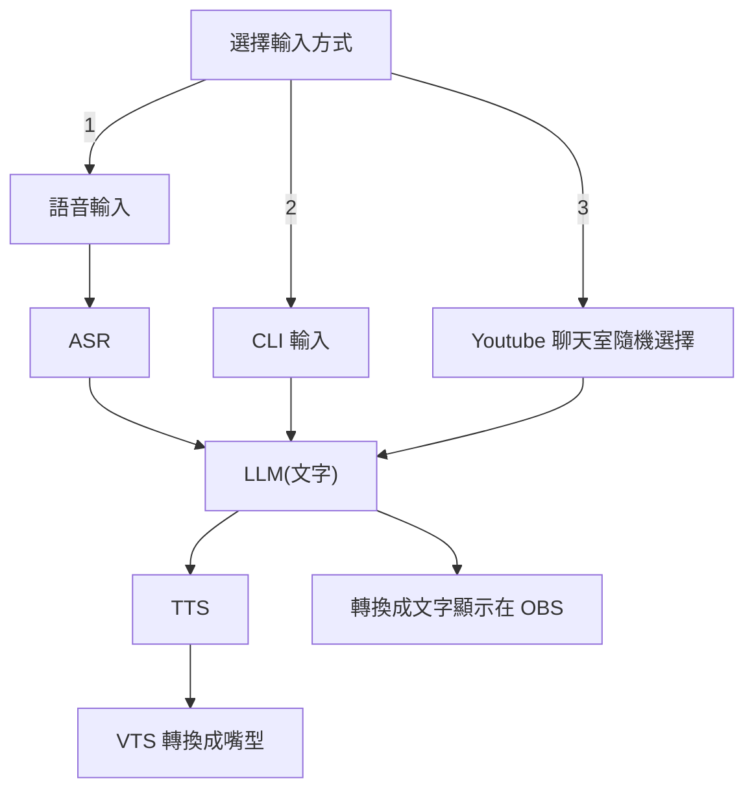

## 前言

高中畢業之後花了大概一個月的時間開發出了一套 AI VTuber 的雛型，有測試直播過了，目前有 CLI 輸入、語音輸入、Youtube 聊天室問答的功能，也就是完成了大概在雜談方面的開發，但這個月參加了各種活動以至於有點小小荒廢了這個專案，想在這個 IThome 鐵人賽中至少完成：

1. 良好記憶系統
2. 點歌
3. 翻唱歌曲
4. 會玩一款遊戲
5. 開 5 場超過 50 人以上參與的直播測試

希望我可以順利達成目標~

之前測試的[直播連結](https://youtu.be/CiBjItykxto?t=336)

<!--more-->

## 目前已有功能的流程圖

然後上面比較有趣的應該是我的 LLM 是拿 Dcard 上的文章 finetune 過的，有做過一些神奇處理，然後還有爬 Dcard 文章真的是非常的有趣，這些之後可能會來分享一下。

## 目標進度與細節

1. 良好記憶系統 (Day2 ~ Day 8)
   - 應該會先使用 RAG 做長期記憶系統，然後短期記憶就直接拿跟他對話的前面幾句話，但把記憶放在前面的模式好像會讓他蠻多幻覺，還會有一些很詭異的回覆，可能要再多做很多很多的 Prompt Engineering 或是 finetune 看看
2. 點歌 (Day9 ~ Day10)
   - 這邊就比較簡單了，讓 LLM 學會輸出某種指令後，可以從歌曲的資料庫中挑選一首他可能想要撥放的歌曲
3. 翻唱歌曲 (Day11 ~ Day15)
   - 這邊應該會套 [So-VITS-SVC](https://github.com/svc-develop-team/so-vits-svc) ，但這東西我沒用過，感覺會有點久
4. 會玩一款遊戲 (Day16 ~ Day25)
   - 我其實一直很想讓 AI 完 MOBA 類遊戲，但感覺這會有點太難，可能賽後再開一個鐵人賽才有機會xd，所以這邊我想先選一點有點挑戰但又好像不會太難的，最好還有點創意，想來想去就決定是 **日麻** (應該就是用雀魂)
5. 開 5 場超過 50 人以上參與的直播測試 (Day2 ~ Day 30)
   - 反正有到一定進度就會開開直播測試，但其實可能會很困難? 或者我可能要研究看看演算法，反正這目標就是先靠佛系經營
