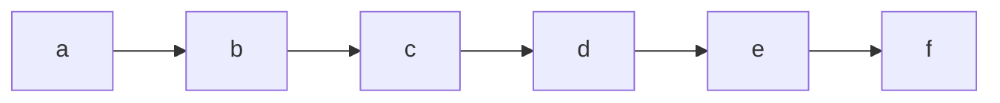
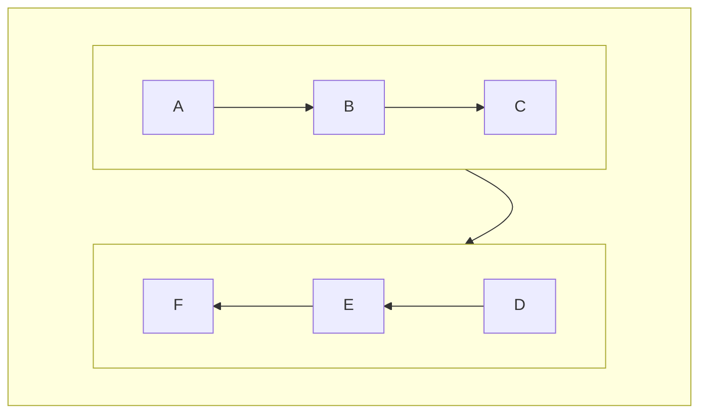
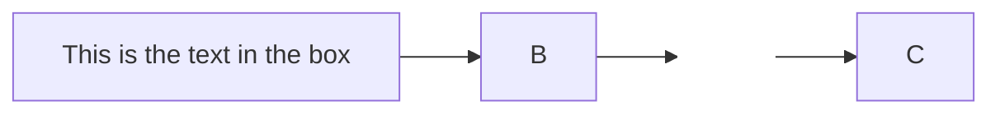

## 前言

常常想要畫一些圖表但總是要去用其他的工具畫完然後再把圖片貼上，這樣很麻煩，所以這邊就來介紹一下怎麼在NexT中畫出漂亮的圖表
<!--more-->

<span id="inline-yellow">注意</span>  
用mermaid可以畫出各種你想表達複雜的圖，但可能不會是你想像中的樣子
例如說你想畫出這種圖：  
  
但你會畫出這種：



或是這樣：



Mermaid的重點是把各種關係自動生成圖表，

## 能畫出哪些圖表

1. Flowchart（流程圖）
2. Pie chart diagrams (圓餅圖)
3. XY Chart (長條圖＆折線圖)
4. Mindmap (心智圖)
5. Timeline (時間軸)
6. Gantt diagrams (甘特圖)
7. Sequence Diagram（時序圖）
8. Class diagrams（類別圖）
9. Block Diagrams (區塊圖)
10. State diagrams（狀態圖）
11. Entity Relationship Diagrams（實體關係圖）
12. User Journey Diagram（使用者旅程圖）
13. Quadrant Chart (四象限圖)
14. Requirement Diagram (需求圖)
15. Gitgraph diagrams
16. ZenUML

## 如何使用

### 環境設置

首先要先配置一下環境，到`./themes/NexT/_config.yml`中找到`mermaid`的配置並改成以下程式碼

```yml
# Mermaid tag
mermaid:
  enable: true
  # Available themes: default | dark | forest | neutral
  theme:
    light: default
    dark: dark
```

然後這邊他有叫你設定在亮暗模式下的主題，這邊我設定的是`default`和`dark`，你也可以試試看其他的，但是，**如果你跟我你樣是可以切換亮暗模式的話，會發現不會隨著背景切換而改變**

<span id="inline-blue">解決切換亮暗的問題</span>  
修改`themes/NexT/source/js/third-party/tags/mermaid.js`中的程式碼，修改判定亮暗模式的部分  
`CONFIG.darkmode && window.matchMedia('(prefers-color-scheme: dark)').matches` $\rightarrow$ `document.body.classList.contains("darkmode--activated")`

```javascript themes/NexT/source/js/third-party/tags/mermaid.js
document.addEventListener('page:loaded', () => {
  const mermaidElements = document.querySelectorAll('.mermaid');
  if (mermaidElements.length) {
    NexT.utils.getScript(CONFIG.mermaid.js, {
      condition: window.mermaid
    }).then(() => {
      mermaidElements.forEach(element => {
        const newElement = document.createElement('div');
        newElement.innerHTML = element.innerHTML;
        newElement.className = element.className;
        const parent = element.parentNode;
        // Fix issue #347
        // Support mermaid inside backtick code block
        if (parent.matches('pre')) {
          parent.parentNode.replaceChild(newElement, parent);
        } else {
          parent.replaceChild(newElement, element);
        }
      });
      mermaid.initialize({
        theme    : document.body.classList.contains("darkmode--activated") ? CONFIG.mermaid.theme.dark : CONFIG.mermaid.theme.light,
        logLevel : 4,
        flowchart: { curve: 'linear' },
        gantt    : { axisFormat: '%m/%d/%Y' },
        sequence : { actorMargin: 50 }
      });
      mermaid.run();
    });
  }
});
```

不過這樣子的話，要改頁面會需要重整，我還想不到怎麼辦法即時切換，如果有人知道的話可以告訴我～

### 插入文本方式

在文本中插入

~~~markdown
```mermaid
type

```
~~~

或是

```jinja


```

type的部分後面會講到，這邊要注意的是如果是放在codeblock中的話，會需要到`_config.yml`中的`highlight`中移除`mermaid`，這樣子才能正確顯示(因為我覺得用codeblock用markdown檢視的時候才會自動生成)

```yml Hexo config file
highlight:
  exclude_languages:
    - mermaid
```

### Flowchart (流程圖)

> type: flowchart  
> 由數個節點（幾何形狀）和邊（箭頭或現）組成  



#### 箭頭指向

- TB / TD：Top to bottom
- BT：Bottom to top
- RL：Right to left
- LR：Left to right

後問待補：可以到[官網](https://mermaid.js.org/intro/)查看

### Pie chart diagrams (圓餅圖)

### XY Chart (長條圖＆折線圖)

### Mindmap (心智圖)

### Timeline (時間軸)

### Gantt diagrams (甘特圖)

### Sequence Diagram（時序圖）

### Class diagrams（類別圖）

### Block Diagrams (區塊圖)

### State diagrams（狀態圖）

### Entity Relationship Diagrams（實體關係圖）

### User Journey Diagram（使用者旅程圖）

### Quadrant Chart (四象限圖)

### Requirement Diagram (需求圖)

### Gitgraph diagrams

### ZenUML

## 補充 - 畫數位時序圖（wavedrom）

這個先不講，之後有空再補(主要是我也不太清楚他怎麼用xd)。然後他和Mermaid一使用會造成字體大小會打架，如果想知道的話可以看看[官方文件](https://theme-next.js.org/docs/tag-plugins/wavedrom)，或是[語法教學](https://wavedrom.com/tutorial.html)

## 結語

<!-- 好誒，表格做出來了～  
如果想看更多用法可以到[官網](https://mermaid.js.org/intro/)查看 -->

## 其他功能

1. 側邊欄

    － [基礎配置(關於、標籤、分類、歸檔、搜尋、頭像、個人相關連結)](/NexT-sidebar-basic)
    － [切換語言](/NexT-sidebar-switch-lang)

2. [頁底](/NexT-footer)
3. [utterances留言板](/NexT-utterances-comment-box)
4. [Google Analytics統計網站資訊](/NexT-google-analytics)
5. [日/夜模式](/NexT-dark-light-mode)
6. [live2d角色（就是網頁右下角那隻可愛的狗狗）](/NexT-live2d)
7. [SEO：搜尋引擎最佳化(Search Engine Optimization)](/SEO-Search-Engine-Optimization)
8. [剩下的一些小工具](/NexT-some-cool-tools)
9. [自訂網域](/Hexo-NexT_custom_domain)