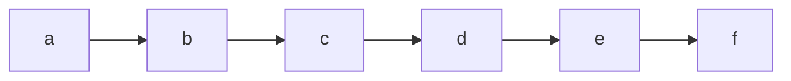
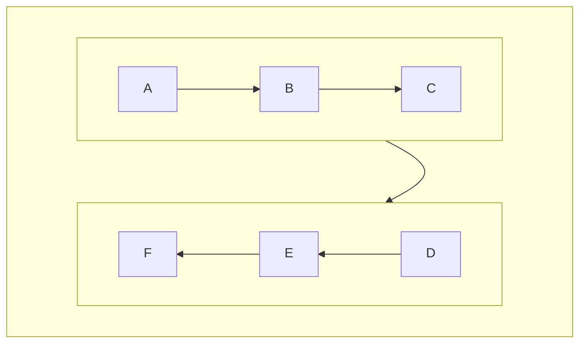
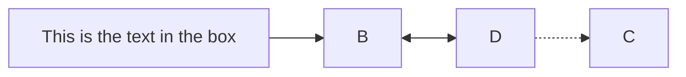
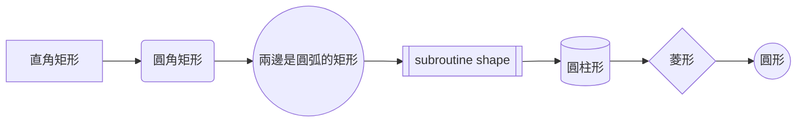
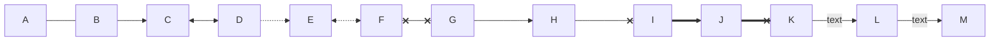

## 前言

常常想要畫一些圖表但總是要去用其他的工具畫完然後再把圖片貼上，這樣很麻煩，所以這邊就來介紹一下怎麼在 NexT 中畫出漂亮的圖表
<!--more-->

<span id="inline-yellow">注意</span>  
用 Mermaid 可以畫出各種你想表達複雜的圖，但可能不會是你想像中的樣子
例如說你想畫出這種圖：  
  
但你會畫出這種：


```mermaid
flowchart LR
    a-->b-->c
    d-->e-->f
    c-->d
```

或是這樣：


```mermaid
flowchart LR
    subgraph x[" "]
        direction TB
        subgraph Z[" "]
        direction LR
            A --> B
            B --> C
        end

        subgraph ZA[" "]
        direction RL
            D-->E
            E-->F
        end

        Z ~~~ ZA
        Z ~~~ ZA
        Z ~~~ ZA
        Z ~~~ ZA
        Z ~~~ ZA
        Z ~~~ ZA
        Z ~~~ ZA
        Z ~~~ ZA
        Z ~~~ ZA
        Z ~~~ ZA
    end
        Z --> ZA
```

Mermaid 的重點是把各種關係自動生成圖表，除了流程圖外他還能生成

- Pie chart diagrams (圓餅圖)

  ```mermaid
  pie
      title Pets adopted by volunteers
      "Dogs" : 386
      "Cats" : 85
      "Rats" : 15
  ```

- Sequence Diagram（時序圖）

  ```mermaid
  sequenceDiagram
      Alice->>Bob: Hello Bob, how are you?
      Bob-->>Alice: I am good thanks!
  ```

- State diagrams（狀態圖）

  ```mermaid
  stateDiagram-v2
      [*] --> Still
      Still --> [*]

      Still --> Moving
      Moving --> Still

      Moving --> Crash
      Crash --> [*]
  ```

- GitGraph Diagrams

  ```mermaid
  gitGraph
      commit
      commit
      branch feature
      checkout feature
      commit
      commit
      checkout main
      merge feature
  ```

## 如何使用

### 環境設置

首先要先配置一下環境，到`./themes/NexT/_config.yml`中找到`mermaid`的配置並改成以下程式碼

```yml
# Mermaid tag
mermaid:
  enable: true
  # Available themes: default | dark | forest | neutral
  theme:
    light: default
    dark: dark
```

然後這邊他有叫你設定在亮暗模式下的主題，這邊我設定的是`default`和`dark`，你也可以試試看其他的，但是，**如果你跟我一樣是用[hexo-next-darkmode 達成切換深淺主題](/NexT-dark-light-mode)的話，會發現 Mermaid 不會隨著背景切換而改變**

<span id="inline-blue">解決切換亮暗的問題</span>  
修改`themes/NexT/source/js/third-party/tags/mermaid.js`中的程式碼，調整判定亮暗模式的部分  
`CONFIG.darkmode && window.matchMedia('(prefers-color-scheme: dark)').matches` $\rightarrow$ `document.body.classList.contains("darkmode--activated")`



```javascript themes/NexT/source/js/third-party/tags/mermaid.js
document.addEventListener('page:loaded', () => {
  const mermaidElements = document.querySelectorAll('.mermaid');
  if (mermaidElements.length) {
    NexT.utils.getScript(CONFIG.mermaid.js, {
      condition: window.mermaid
    }).then(() => {
      mermaidElements.forEach(element => {
        const newElement = document.createElement('div');
        newElement.innerHTML = element.innerHTML;
        newElement.className = element.className;
        const parent = element.parentNode;
        // Fix issue #347
        // Support mermaid inside backtick code block
        if (parent.matches('pre')) {
          parent.parentNode.replaceChild(newElement, parent);
        } else {
          parent.replaceChild(newElement, element);
        }
      });
      mermaid.initialize({
        theme    : document.body.classList.contains("darkmode--activated") ? CONFIG.mermaid.theme.dark : CONFIG.mermaid.theme.light,
        logLevel : 4,
        flowchart: { curve: 'linear' },
        gantt    : { axisFormat: '%m/%d/%Y' },
        sequence : { actorMargin: 50 }
      });
      mermaid.run();
    });
  }
});
```



不過這樣子的話，要重整頁面才會切換，如果要做到按下深淺模式切換就馬上更新的話，可以將目前 Mermaid 原始內容（就是生成圖表的那些文字）先存起來，當主題切換時（可以偵測 `body` 是否有包含 `darkmode--activated` 這個 class）將每張 Mermaid 重新 render 就沒問題了。



```javascript themes/NexT/source/js/third-party/tags/mermaid.js
// Store original source for each mermaid element so we can re-render on theme change.
const mermaidSources = new WeakMap();

const renderMermaid = elements => {
    elements.forEach(element => {
        const src = mermaidSources.get(element) || element.textContent;
        const newElement = document.createElement('div');
        newElement.className = 'mermaid';
        newElement.textContent = src;
        mermaidSources.set(newElement, src);
        const parent = element.parentNode;
        // Fix issue #347
        // Support mermaid inside backtick code block
        if (parent.matches('pre')) {
          parent.parentNode.replaceChild(newElement, parent);
        } else {
          parent.replaceChild(newElement, element);
        }
    });
    mermaid.initialize({
        theme    : document.body.classList.contains("darkmode--activated") ? CONFIG.mermaid.theme.dark : CONFIG.mermaid.theme.light,
        logLevel : 4,
        flowchart: { curve: 'linear' },
        gantt    : { axisFormat: '%m/%d/%Y' },
        sequence : { actorMargin: 50 }
    });
    mermaid.run();
};

document.addEventListener('page:loaded', () => {
    const mermaidElements = document.querySelectorAll('.mermaid');
    if (!mermaidElements.length) return;

    NexT.utils.getScript(CONFIG.mermaid.js, {
        condition: window.mermaid
    }).then(() => {
        // Save original sources before first render.
        mermaidElements.forEach(el => mermaidSources.set(el, el.textContent));
        renderMermaid(Array.from(mermaidElements));

        // Re-render when dark/light mode is toggled.
        let lastDark = document.body.classList.contains('darkmode--activated');
        const observer = new MutationObserver(() => {
            const isDark = document.body.classList.contains('darkmode--activated');
            if (isDark === lastDark) return;
            lastDark = isDark;
            const current = document.querySelectorAll('.mermaid');
            if (current.length) renderMermaid(Array.from(current));
        });
        observer.observe(document.body, { attributes: true, attributeFilter: ['class'] });
    });
});
```



### 插入文字方式

在文章中中插入

~~~markdown
```mermaid
type

```
~~~

或是

```jinja


```

type 的部分後面會講到，這邊要注意的是如果是放在 codeblock 中的話，會需要到 `_config.yml` 中的 `highlight` 中移除 `mermaid`，這樣子才能正確顯示（會建議使用這種方式，因為這樣子使用其他有支援生成 Mermaid 的 Markdown 檢視器時（如 HackMD、[VScode Preview](https://code.visualstudio.com/docs/languages/markdown#_markdown-preview) 或 GitHub，這些圖表才會自動生成）

```yml Hexo config file
highlight:
  exclude_languages:
    - mermaid
```

### Flowchart (流程圖)

> type: flowchart  
> 由數個節點（幾何形狀）和邊（箭頭或現）組成  


```mermaid
flowchart LR
  A[This is the text in the box]-->B
  B<-->D
  D-.->C
```

~~~markdown

```mermaid
flowchart LR
  A[This is the text in the box]-->B
  B<-->D
  D-.->C
```
~~~

#### 流程圖的方向

就是在 flowchart 後面接的東西

- TB / TD：Top to bottom
- BT：Bottom to top
- RL：Right to left
- LR：Left to right

#### 節點的形狀

- 直角矩形：`[text]`
- 圓角矩形：`(text)`
- 兩邊是圓弧的矩形（stadium-shaped）：`((text))`
- subroutine shape：`[[text]]`
- 圓柱形：`[(text)]`
- 菱形：`{text}`
- 園形：`((text))`
- 還有更多可以參考[官網說明](https://mermaid.ai/open-source/syntax/flowchart.html#node-shapes)

~~~markdown

```mermaid
flowchart LR
  A[直角矩形]-->B(圓角矩形)
  B-->C((兩邊是圓弧的矩形))
  C-->D[[subroutine shape]]
  D-->E[(圓柱形)]
  E-->F{菱形}
  F-->G((圓形))
```
~~~


```mermaid
flowchart LR
  A[直角矩形]-->B(圓角矩形)
  B-->C((兩邊是圓弧的矩形))
  C-->D[[subroutine shape]]
  D-->E[(圓柱形)]
  E-->F{菱形}
  F-->G((圓形))
```

#### 邊的種類

- 無箭頭的線：`---`
- 實線箭頭：`-->`
- 實線雙箭頭：`<-->`
- 虛線箭頭：`-.->`
- 虛線雙箭頭：`<-.->`
- 叉叉的箭頭：`x--x`
- 比較長的線：`--->`、`---x`
- 更長的線：`---->`、`----x`
- 比較粗的線：`==>`、`==x`
- 在線上加文字：`-- text -->` 或是 `-->|text|` 其他箭頭同理
- 更多可以參考[官網說明](https://mermaid.ai/open-source/syntax/flowchart.html#links-between-nodes)，或者直接問問各種 AI

~~~markdown

```mermaid
flowchart LR
  A --- B
  B --> C
  C <--> D
  D -.-> E
  E <-.-> F
  F x--x G
  G ---> H
  H ---x I
  I ==> J
  J ==x K
  K -- text --> L
  L -->|text| M
```
~~~


```mermaid
flowchart LR
  A --- B
  B --> C
  C <--> D
  D -.-> E
  E <-.-> F
  F x--x G
  G ---> H
  H ---x I
  I ==> J
  J ==x K
  K -- text --> L
  L -->|text| M
```

### 其他圖表

Mermaid 是一個很強大的工具，除了上面的流程圖外，還有 [Pie chart diagrams (圓餅圖)](https://mermaid.js.org/syntax/pie.html)、[Sequence Diagram（時序圖）](https://mermaid.js.org/syntax/sequenceDiagram.html)、[User Journey Diagram](https://mermaid.js.org/syntax/userJourney.html)、[GitGraph](https://mermaid.js.org/syntax/gitgraph.html)、[State Diagrams（狀態圖）](https://mermaid.js.org/syntax/stateDiagram.html) 等等，可以到[官網](https://mermaid.js.org/intro/)查看更多說明！

## 延伸閱讀

- [Mermaid Tutorials](https://mermaid.js.org/ecosystem/tutorials.html)

## 其他功能

1. 側邊欄

    － [基礎配置（關於、標籤、分類、歸檔、搜尋、頭像、個人相關連結）](/NexT-sidebar-basic)
    － [切換語言](/NexT-sidebar-switch-lang)

2. [頁底](/NexT-footer)
3. [utterances 留言板](/NexT-utterances-comment-box)
4. [Google Analytics 統計網站資訊](/NexT-google-analytics)
5. [日/夜模式](/NexT-dark-light-mode)
6. [live2d 角色（就是網頁右下角那隻可愛的狗狗）](/NexT-live2d)
7. [SEO：搜尋引擎最佳化（Search Engine Optimization）](/SEO-Search-Engine-Optimization)
8. [剩下的一些小工具](/NexT-some-cool-tools)
9. [自訂網域](/Hexo-NexT_custom_domain)
