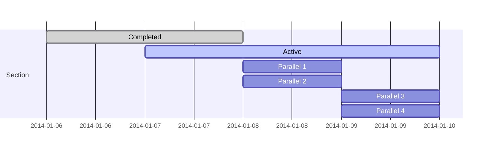
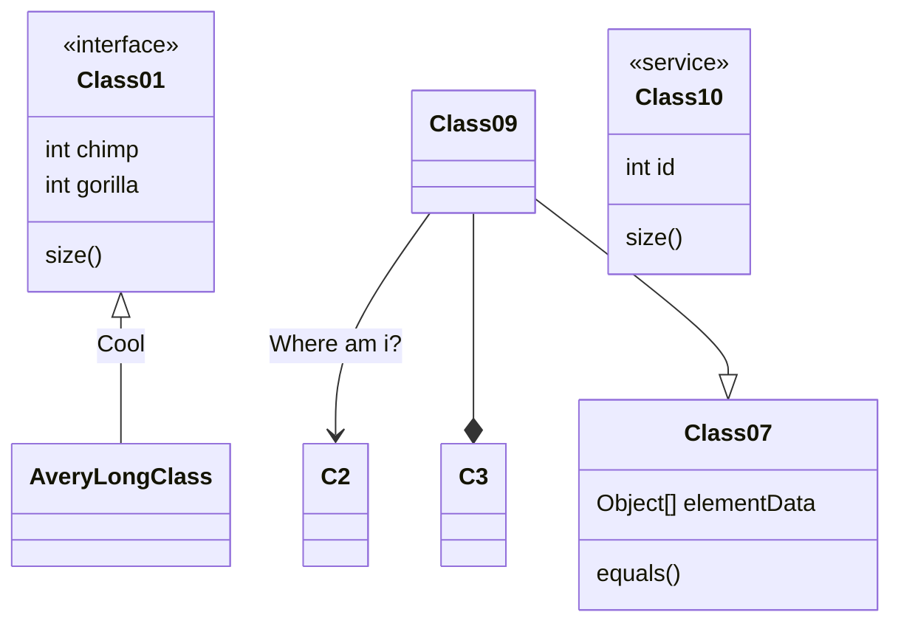
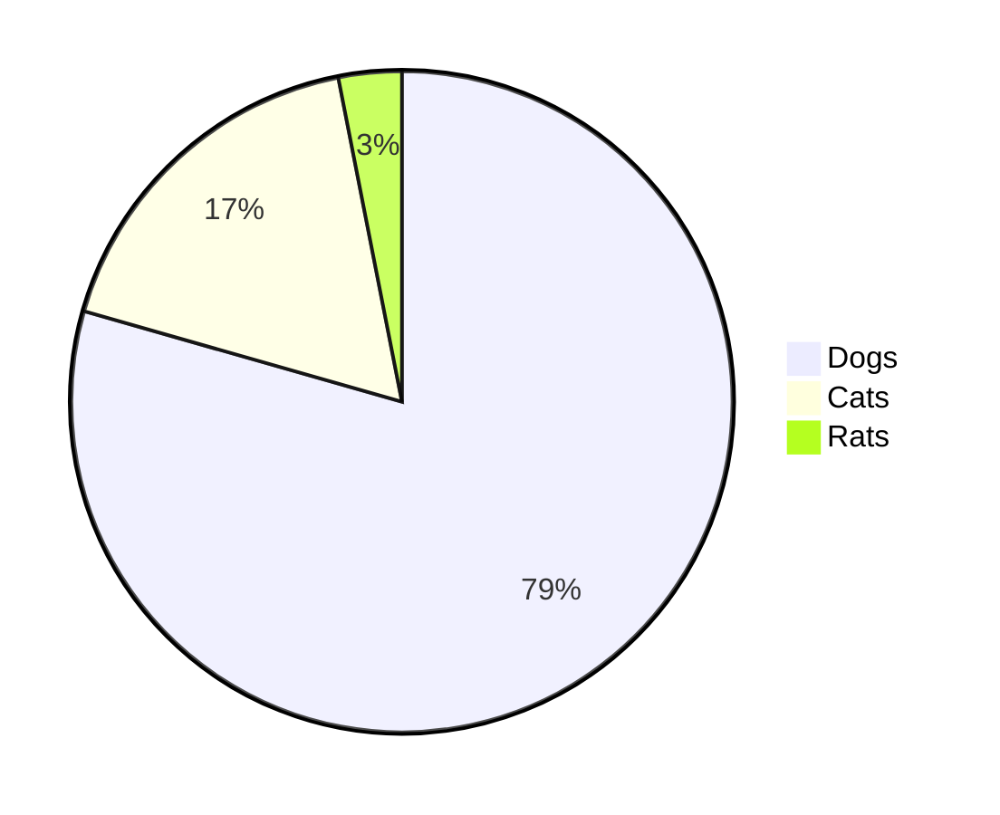

## 前言

在這篇中所講述的是一些可以沒有，但是有的話**可能**會很方便的酷東東

<!--more-->

## vscode-imgur


就是要申請API讓vscode使用，詳細教學可以[看這邊](https://israynotarray.com/hexo/20201012/473855281/)

## 閱讀更多按鈕

如果沒有這個的話在一開始首頁的地方全部文章都會是展開的，這樣對於要翻看有哪些內容就很不方便，網站整體觀感也會不好，因此可以新增一個閱讀更多的按鈕，設定每篇文章要顯示多少內容給使用者看，這個部分我有在[SEO優化的description中說明](/SEO-Search-Engine-Optimization/#新增description)

## 標題前的圖示

這個有一個比較簡單的方法，在`theme/NexT(改成你的主題名稱)/source/css/main.styl`，貼上以下程式碼，裡面的符號可以改成自己的

```css
/*修改h2前面圖標*/
.posts-expand .post-body h2:before{
    content: "🔍";
    margin-right: 16px;
}

/*修改h3前面圖標*/
.posts-expand .post-body h3:before{
    content: "📌";
    margin-right: 16px;
}
```

另外一個方法就是到最外層資料夾中的`source`新建一個`_data`的資料夾，然後在裡面新增`styles.styl`這個檔案（也就是`source/data/styles.styl`，然後將剛剛上面的程式碼貼在裡面，最後到`theme/NexT(改成你的主題名稱)/_config.yml`將custom_file_path的最後一項`style: source/_data/styles.styl`的註解取消，就完成了


## MathJax

這個部分篇幅比較長一點，所以我單獨又寫了一篇[講解](/Hexo-Next_MathJax)，效果就是像下面那樣，可以插入各種算式，甚至化學式也可以

$$
A = \begin{bmatrix}
        a_{11}    & a_{12}    & ...    & a_{1n}\\
        a_{21}    & a_{22}    & ...    & a_{2n}\\
        a_{31}    & a_{22}    & ...    & a_{3n}\\
        \vdots    & \vdots    & \ddots & \vdots\\
        a_{n1}    & a_{n2}    & ... & a_{nn}\\
    \end{bmatrix} , b = \begin{bmatrix}
        b_{1}  \\
        b_{2}  \\
        b_{3}  \\
        \vdots \\
        b_{n}  \\
    \end{bmatrix}
$$

$$
\begin{aligned}
a &= b + c \\  
  &= d + e + f + g \\  
  &= h + i
\end{aligned}
$$

$$
e=mc^2
$$

$$
C_p[\ce{H2O(l)}] = \pu{75.3 J // mol K}
$$

## 文章編輯按鈕


## Travis Ci 自動部署

搭配上一項編輯按鈕食用，這邊先看[前輩寫的文章](https://israynotarray.com/hexo/20201009/3159624676/)，之後有時間我在重新寫一篇

## npm套件自動更新

不知道你有沒有在生成網頁的時候出現npm套件的問題(可能就是在執行`hexo clean` `hexo g` `hexo d` `hexo s`時)，如下圖，在經過多次測試之後發現大部分都是因為版本有問題，後來我發現了一個[檢查套件版本的工具](https://github.com/raineorshine/npm-check-updates)，自動檢查哪些版本過舊並升級，大多數狀況在升級後就沒事了


## Hexo PDF預覽

可以在網頁裡展示PDF，[hexo-pdf](https://github.com/superalsrk/hexo-pdf)
記得要把主題內的pdf設成`true`

然後如果想讓每個頁面出現的pdf不一樣大可以用以下程式碼

``` html
<embed src="ooxx.pdf" width=100% height="自己設" type="application/pdf">
```

## NexT Group Picture

使用指令

```markdown


```


## 繪製圖表

教學在[這邊](./NexT_chart)  
可以畫出像下面各種的表格







或是可以畫時序圖（wavedrom）


{ signal: [
  { name: "clk",         wave: "p.....|..." },
  { name: "Data",        wave: "x.345x|=.x", data: ["head", "body", "tail", "data"] },
  { name: "Request",     wave: "0.1..0|1.0" },
  {},
  { name: "Acknowledge", wave: "1.....|01." }
]}



{ signal: [
  { name: 'A', wave: '01........0....',  node: '.a........j' },
  { name: 'B', wave: '0.1.......0.1..',  node: '..b.......i' },
  { name: 'C', wave: '0..1....0...1..',  node: '...c....h..' },
  { name: 'D', wave: '0...1..0.....1.',  node: '....d..g...' },
  { name: 'E', wave: '0....10.......1',  node: '.....ef....' }
  ],
  edge: [
    'a~b t1', 'c-~a t2', 'c-~>d time 3', 'd~-e',
    'e~>f', 'f->g', 'g-~>h', 'h~>i some text', 'h~->j'
  ],
  config:{skin:'lowkey'}
}


## 結語

這些酷酷的工具是不是也挺方便的呢？如果有問題或者發現我還有什麼酷酷的功能沒有講到，歡迎大家到底下留言區跟我討論喔～

## 其他功能

1. 側邊欄

    － [基礎配置(關於、標籤、分類、歸檔、搜尋、頭像、個人相關連結)](/NexT-sidebar-basic)
    － [切換語言](/NexT-sidebar-switch-lang)

2. [頁底](/NexT-footer)
3. [utterances留言板](/NexT-utterances-comment-box)
4. [Google Analytics統計網站資訊](/NexT-google-analytics)
5. [日/夜模式](/NexT-dark-light-mode)
6. [live2d角色（就是網頁右下角那隻可愛的狗狗）](/NexT-live2d)
7. [SEO：搜尋引擎最佳化(Search Engine Optimization)](/SEO-Search-Engine-Optimization)
8. 剩下的一些小工具 ✅
9. [自訂網域](/Hexo-NexT_custom_domain)
