<!-- TODO 把圖片改成精美動畫 -->

## 前言

一個由多個站點連接而成的網絡裡，每對站點之間都有一定的數據傳輸限制(單向)。現在你需要計算從網絡的入口（ $s$ ）到出口（ $t$ ）之間，數據可以同時傳輸的最大速度是多少。  
如下圖，從 $s$ 到 $t$ 的最大傳輸速度為2，最大速度會被路徑上最大傳輸流量所限制，因爲從 $s$ 到 $t$ 勢必通過路線 $v1\rightarrow v2$ ，故這張圖的最大流量為2。

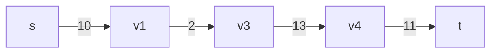

而下面這個圖的最大流量為19，下文提供一種可能的傳輸方式：

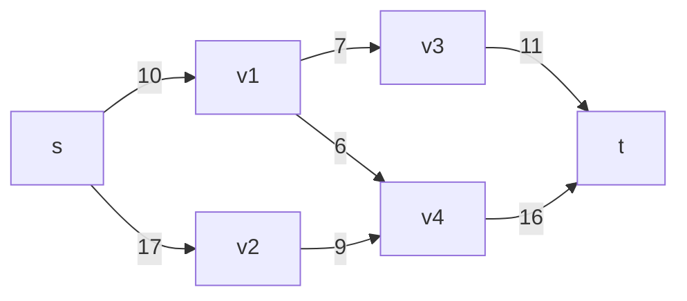

- 傳輸7： $s\rightarrow v1\rightarrow v3\rightarrow t$
- 傳輸3： $s\rightarrow v1 \rightarrow v4 \rightarrow t$ (因為 $s\rightarrow v1$ 最多只能傳輸10因此在前一次傳輸7之後，接下來就只能傳輸3了)
- 傳輸9： $s \rightarrow v2 \rightarrow v4 \rightarrow t$
- 7+3+9=19

上述這樣的圖叫做Network Flow(網路流)，在這樣的圖上尋找這種`最大流`的想法還可以運用在`最小割`(後文會再解釋)、`最多不重複路徑`、`二分圖最大匹配`、`二分圖最小頂點覆蓋`等圖論問題。

<!--more-->

## `Network Flow(網路流)` 的基本定義

這邊可以先看個印象，之後如果有忘的再回來看

- A directed graph $G = (V,E)$  
- 只有一個 source point(入口，記作 $s$ ) 和一個 sink point(出口，記作 $t$ )  
- $|V|$ 為頂點數，$|E|$ 為邊數  
- $c(u,v)$ (Capacity)：表示從 $u$ 到 $v$ 的容量 (也就等價於前面舉例的最大流量限制，是圖給定的)  
- $f(u,v)$ (Flow)：表示從 $u$ 到 $v$ 的流量 (是可以自己設定的)  
- $|f|=\sum_{u\in V}f(s,v)$ (也就是從起點流出的總量)
- $r(u,v)$ (Residual Capacity)： $edge(u,v)$ 上扣除已有流量還可以傳輸多少流量才會飽和，意即 $r(u,v)=c(u,v)-f(u,v)$ (Residual Capacity = Capacity - Flow)
- $c_{max}$ 表示所有 $c(u,v)$ 中最大的那個
- Residual Graph：邊上數字皆為剩餘容量的圖
- augmenting path：一條起點為 $s$ ，終點為 $t$ 的簡單路徑（沒有環）
- backward edge：反向邊（之後會提到）
- $\forall \ edge(u,v) \notin E \Rightarrow c(u,v) = 0 \Rightarrow f(u,v) = 0$
- $\forall \ u \in V - \{s, t\} , \ \exists \ path: \ s \rightarrow u \rightarrow t$
- 容量限制：恆有 $0 \leq f(u,v) \leq c(u,v)$
- 流量守恆： $\forall \ u \in V - \{s,t\}, \ \sum_{v\in V}f(u,v) = \sum_{v\in V}f(v,u)$
- 一個 $s-t\ cut$ 表示能將圖切成兩個集合 $S,T$ ，滿足：
  - $S\cap T = \emptyset , \ S\cup T = V$
  - $s\in S, \ t\in T$

<!-- ## 性質

- $|f|=\sum_{u\in V}f(s,v)=\sum_{u\in V}f(v,t)$ ，可以很直觀想作輸入流量等於輸出流量，或是利用流量守恆來證明：  
  $\sum_{u \in V- \{s,t\}}(\sum_{v\in V}f(u,v)-\sum_{v\in V}f(v,u))$ $=\sum_{u\in V}f(s,v)-\sum_{u\in V}f(v,t)=0$ -->

## 何謂最大流(Max-Flow)與最小割(Min-Cut)

- 最大流(Max-Flow)：從 $s$ 到 $t$ 的最大流量，寫的嚴謹一點就是： $|f|=\sum_{u\in V}f(s,v)$ 的最大值
- 最小割(Min-Cut)：一個 $s-t\ cut$ ，使得 $c(S,T)=\sum_{u\in S, v\in T}c(u,v)$ 為最小值

而特別的是一張圖的最大流量等於最小割的容量，這個性質會在後續講述[最小割](/algo_Max-Flow_and_Min-Cut/#最小割)時證明

## 怎麼找到最大流？

我們或許可以從 $s$ 開始，每次找到一條augmenting path，然後`貪心`地將這條路徑上每個邊的流量增加路徑上所有邊中最小的Residual Capacity，不斷增加流量直到沒辦法增加為止 (增加流量視同於減少等量Residual Capacity)，最後一路上所增加的流量 (或是減少的Residual Capacity) 或許就是最大流...嗎?  

<!-- TODO 舉例 可以用Naive Algo成功的案例 -->

我們試著用這個方法來找找看。(圖上邊標示的數字代表 Residual Capacity ，而起始時因為 Flow=0 所以 Residual Capacity = Capacity)


一開始走 $s \rightarrow v1 \rightarrow v3 \rightarrow t$ ，這條路線上最小的 Residual Capacity 是 7 ，所以將每條路徑的 Residual Capacity 都減 9 ，那如果已經沒有剩餘流量的話就代表不能走了，所以我們就直接將這條邊移除 (此時累計減少的 Residual Capacity = 7)

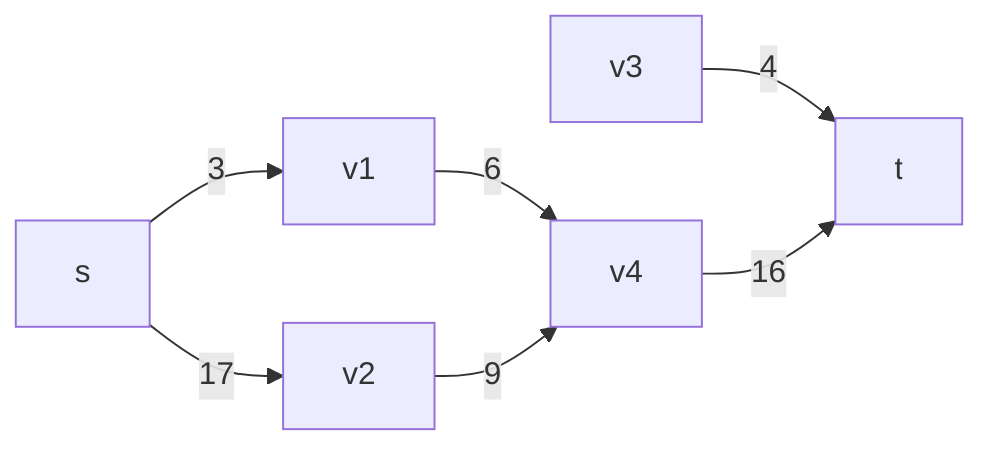

接著走 $s \rightarrow v1 \rightarrow v4 \rightarrow t$ ，這條路線上最小的 Residual Capacity 是 3 ，於是就將路徑都減 3 ，然後移除剩餘流量為 0 的邊 (此時累計減少的 Residual Capacity = 10)

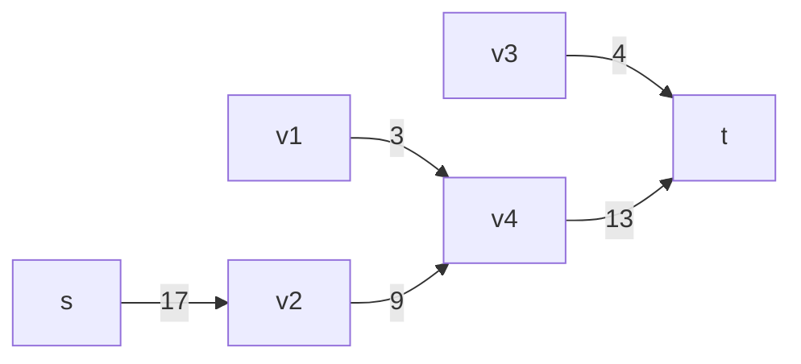

最後就只剩下 $s \rightarrow v2 \rightarrow v4 \rightarrow t$ ，這條路線上最小的 Residual Capacity 是 9 ，於是就將路徑都減9，然後移除剩餘流量為 0 的邊 (此時累計減少的 Residual Capacity = 19)

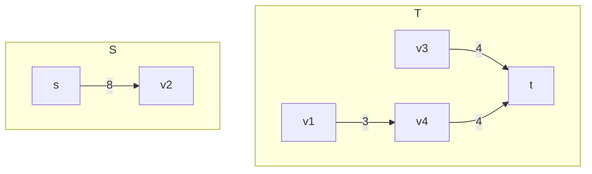

因為已經沒辦法再找到一條 $s$ 到 $t$ 的簡單路徑了，所以就認為這張圖的最大流為 19 ，我們就來整理看看這個感覺會成功的想法。

### Naïve Algorithm

因為需要找到一路上最小的Residual Capacity，所以我們將圖上的邊設為Residual Capacity會相較同時紀錄Flow和Capacity來得方便，並且認定當某條邊的Residual Capacity為0時，那該條路徑已經不能夠走了，因此就能將終止條件`不斷增加流量直到沒辦法增加為止`改為`找不到一條augmenting path`(若是沒辦法繼續增加流量，就代表無法找到一條augmenting path上所有的Residual Capacity皆不為0)，我們可以根據以上邏輯寫出虛擬碼：



#### Naïve Algorithm 虛擬碼  

Initialize $r(u, v)=c(u, v) \ \forall \ edge(u,v) \in E$  
let $answer$ be $0$  
while exist an augmenting path $p$  
　　let $min_r$ be $min_{edge(u, v) \in p}r(u, v)$  
　　　　for each $edge(u, v)$ in $p$  
　　　　　　$r(u, v)$ -= $min_r$  
　　　　　　$answer$ += $min_r$


不過呢，其實這個做法是不對的，來看個反例

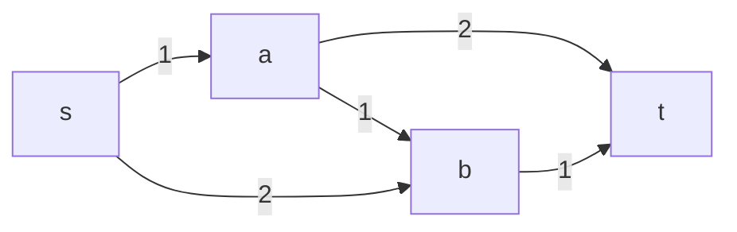

如果一開始走的是 $s\rightarrow a \rightarrow b \rightarrow t$ 的話，那整條路就中斷了，而這時的流量為1，但很明顯的更好的做法應該是 $s \rightarrow a \rightarrow t$ 和 $s \rightarrow b \rightarrow t$ 這時的流量為2。

難道努力這麼久想到的方法就這樣付之一炬了嗎?我們有沒有可能想個辦法讓把原先走錯的路線`復原`，讓路給其他的流量走呢?這就是`Ford–Fulkerson Algorithm`的精神。

### Ford–Fulkerson Algorithm (時間複雜度$O(fE)$)

這就輪到的先前提到的`backward edge(反向邊)`出場了，我們在每次找到一條augmenting path時，將這條路徑上所有的邊的Residual Capacity減少，同時增加一條反向邊，將減少的Residual Capacity加到反向邊上，到時候其他路徑被該條路阻塞時，這條反向邊就像是能提供原先走錯路線`復原`的功能，`讓路`給其他的流量走，或許這樣講不夠清楚，我們直接將這個方法套用到先前失敗的例子上

<!-- TODO 如果有精美動畫，希望可以展示出來哪一條水流是從哪邊流的(maybe用顏色)，而撤回時就是把該顏色的水流流向復原能夠流經的地方-->


一開始一樣走 $s\rightarrow a \rightarrow b \rightarrow t$ ，因為路的最大剩餘容量為1，因此將augmenting path 上的路線-1，並新增一條為反向剩餘容量為1的邊

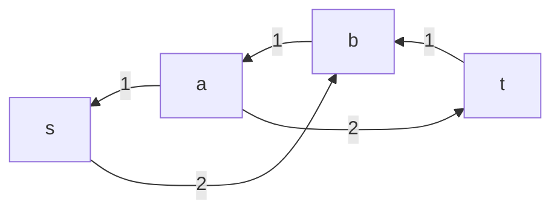

這時因為有反向邊的關係，所以還可以走 $s \rightarrow b \rightarrow a \rightarrow t$ 這條路線，這條路的最大剩餘容量為1，因此將augmenting path 上的路線-1，並新增一條為反向剩餘容量為1的邊，且在經過此操作後已經沒有任何augmenting path，所以答案就是減少的Residual Capacity總量也就是2，符合答案  

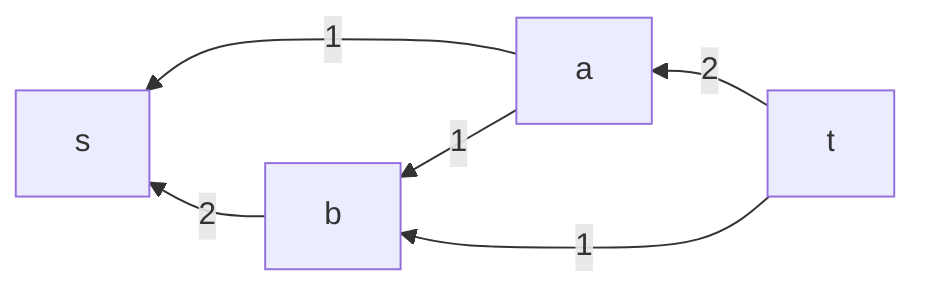

那麼為什麼這樣會對呢？如前文所說我們的反向邊是擔任一個`復原`的角色，當第二次路徑走 $b \rightarrow a \rightarrow t$ 時，就像是跟上一次的路線說：「欸，你從 $a$ 明明就可以直接走到 $t$ ，我們來交換一下，你把上次走 $b\rightarrow t$ 的路權給我，然後你就不要走 $a\rightarrow b$ 這條路，改走我這次幫你發現的 $a\rightarrow t$ 這條路，這樣一來我們才可以創造最大價值！」

而實現的的方法非常簡單，只要將原先的虛擬碼再多一個建立反向邊的程式就完成了



#### Ford–Fulkerson Algorithm 虛擬碼  

Initialize $r(u, v)=c(u, v) \ \forall \ edge(u,v) \in E$  
let $answer$ be $0$  
while exist an augmenting path $p$  
　　let $min_r$ be $min_{edge(u, v) \in p}r(u, v)$  
　　　　for each $edge(u, v)$ in $p$  
　　　　　　$r(u, v)$ -= $min_r$  
　　　　　　$r(v, u)$ += $min_r$  
　　　　　　$answer$ += $min_r$


#### 複雜度

考慮到最糟糕的情況，每次都只增加1的流量，那麼最多就會需要增加最大流量次，這裡舉一個例子：

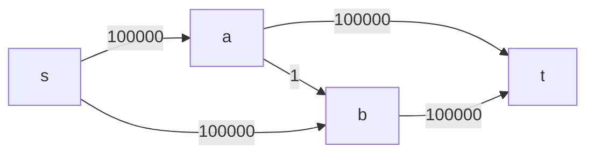

考慮最糟狀況一開始從 $s\rightarrow a \rightarrow b \rightarrow t$ ，然後下一輪因為生成反向邊 $(b,a)$ 然後走 $s \rightarrow b \rightarrow a \rightarrow t$ 然後下一輪再走 $s\rightarrow a \rightarrow b \rightarrow t$ ......如此反覆下去每次都只會使得流量增加1直到達到最大流，而就這個例子來說就是會走200000次

所以最壞的情況下，時間複雜度為 $O(fE)$ ， $f$ 為最大流量， $E$ 為邊數。很顯然的在流量很大很大可能 $10^9$ 的情況下，這種方法是不好的，那有沒有什麼樣遍歷的方法可以讓每次增加的流量盡可能的高減少遍歷次數呢?這就是`Edmonds-Karp Algorithm`和`Capacity Scaling Algorithm`在做的事。

### Edmonds-Karp Algorithm (時間複雜度$O(|V||E|^2)$)

在找augmenting path時，除了DFS之外，還有BFS可以用啊，利用BFS每次尋找`最短`的augmenting path會不會比較快呢？

答案是會的，以下就是證明內容：

以 $d_G(u)$ 表示 $s$ 到 $u$ 的最短距離，而若 $u$ 是G這張Residual Graph中`最短`的augmenting path $P$，那麼這條路徑上從 $s$ 到 $u$ 的距離，就會是 $d_G(u)$（否則路徑 $P$ 就應該走那條更短的路），而在這個狀況下，也就必定會滿足：$d_G(v) = d_G(u) + 1$ $\ \forall \ edge(u,v) \in P$ (否則路徑P就應該走那條更短的路線到 $u$ )

我們在BFS的時候找到最短augmenting path，令這條路徑上的最小Residual Capacity為 $r(u, v)$ ，紀錄當前的Residual Graph為 $G_1$ ，而所以在這輪之後，Residual Graph中的 $r(u, v)$ 就會變成 $0$ ，若是在之後的Residual Graph $G_2$ 中有一條augmenting path包含 $edge(v, u)$ ，那麼這條邊就會重新`復活`，而 $d(u)$ 會發生神奇的變化，使得每條邊最多只會被使用 $|V|$ 次，而以下就是詳細的說明：

- $d_{G_1}(v) = d_{G_1}(u) + 1$
- $d_{G_2}(u) = d_{G_2}(v) + 1$
- $d_{G_1}(v) \leq d_{G_2}(v)$  
  
  為了避免這邊與先前所用的符號重疊導致混淆，這邊改為使用 $x,y,z,a,b,c$ 等其它記號表示。  
  我們可以不失一般性的假設 $G_2$ 是 $G_1$ 的下一張圖，因為當這個情況下假設成立，可使用遞迴的方式證明 $G_1$ 後的數張圖皆成立 ( $G_2$ 成立則 $G_2$ 下一張圖會成立則 $G_2$ 下下一張圖成立......)  
  試以反證法證明 $\forall \ x\in V, \ d_{G_1}(x) > d_{G_2}(x)$ 不成立：  
  1. 對於 $s$ 或所有與 $s$ 僅通過一條邊聯通的節點所形成的集合 $Y$ ，其中任意一點 $y$ 皆滿足 $d_{G_1}(y) \leq d_{G_2}(y)$  
  2. 由上可知，對圖上一些滿足 $d_{G_1}(z) > d_{G_2}(z)$ 的點集 $Z$ ， $Z \subsetneqq V$ ，而這邊特別定義 $a$ 為符合 $min_{i\in Z}d_{G_2}(i)$ 的一點，也就是 $Z$ 集合中在 $G_2$ 中距離 $s$ 最近的節點。  
  3. $\because Z \cap Y = \emptyset \ \therefore$ 從 $s$ 到 $a$ 一定需要一個中繼點也就是說   $\exists \ edge(b, a)\in G_2$ 使得 $s$ 到 $a$ 的最短路徑中包含 $edge(b, a)$  
   $\implies d_{G_2}(b) + 1 = d_{G_2}(a)$  
   $\implies d_{G_2}(b) < d_{G_2}(a)$  
   $\implies b \notin Z$ (因為 $d_{G_2}(a)$ 是在 $Z$ 中最短的)  
   $\implies d_{G_1}(b) \leq d_{G_2}(b)$  
  4. 若在 $G_1$ 的Residual Graph包含 $edge(b,a)$，而從 $s$ 到 $a$ 點的最短距離有可能是經過 $b$ 再到 $a$ 或是有另外一條更短的路  
   $\implies d_{G_1}(a) \leq d_{G_1}(b)+1$  
   $\implies d_{G_1}(a) \leq d_{G_2}(b)+1$ (由 $d_{G_1}(b) \leq d_{G_2}(b)$ 推得)  
   $\implies d_{G_1}(a)\leq d_{G_2}(a)$ (由 $d_{G_2}(a) = d_{G_2}(b)+1$ 推得)  
   $\implies$ 與假設 $d_{G_1}(a) > d_{G_2}(a)$ 矛盾，故在 $G_2$ 中 $Z$ 不存距離 $s$ 最近的節點，故 $Z$ 不存在
  5. 若在 $G_1$ 的Residual Graph不包含 $edge(b,a)$ ，又因為 $G_2$ 是 $G_1$ 的下一張圖，所以這種狀況只有可能是 $G_1$ 的augmenting path流經 $edge(a,b)$ ，使得在下一張圖創造了一條 $edge(b,a)$ ，因此可以給定 $d_{G_1}(a)+1 = d_{G_1}(b)$  
   $\implies d_{G_1}(a)+1 \leq d_{G_2}(b) = d{G_2}(a)-1$  
   (由 $d_{G_1}(b) \leq d_{G_2}(b)$ 和 $d_{G_2}(a) = d_{G_2}(b)+1$ 推得)  
   $\implies d_{G_1}(a)+2 \leq d{G_2}(a)$  
   $\implies d_{G_1}(a) < d{G_2}(a)$  
   $\implies$ 與假設 $d_{G_1}(a) > d_{G_2}(a)$ 矛盾，故在 $G_2$ 中 $Z$ 不存距離 $s$ 最近的節點，故 $Z$ 不存在  

   p.s. 這個證明不知道為什麼感覺好像網路上找到的都有種跳太快的感覺，花了好多時間才看懂，所以這邊特別寫得很詳細，希望大家都能看懂(~~還是其實單純我太笨了xd~~)  
  
- $d_{G_1}(u)+1 \leq d_{G_2}(u)-1$  
  $\implies d_{G_1}(u)+2 \leq d_{G_2}(u)$  
- $\forall \ G, \ d_{G}(u) < |V|$ 又因為一條邊每被重複用一次就會遠離 $s$ 兩個節點  
  $\implies$ 每條 $edge(u,v)$ 必定只會被使用 $\frac{|V|}{2}$  
- 總共有 $|E|$ 條邊，每條邊最多被使用 $\frac{|V|}{2}$ 次，所以最多有 $|E|\times\frac{|V|}{2}$ 次BFS，又每次BFS的時間複雜度為 $O(|E|)$ ，所以總時間複雜度為 $O(|V||E|^2)$

`註：因為這個演算法的實作其實不是很方便，而且複雜度也比後面要講的差，所以這個演算法應該是比較少會用到的`

### Capacity Scaling Algorithm (時間複雜度$O(|E|^2(1+log(c_{max}))$)

這個演算法我喜歡多了，證明簡單設計巧妙，而且在幾乎所有的狀況下複雜度都比前者好(除非 $c_{max}>2^{|V|}$)，因此通常我都是使用這個演算法來寫題目。

這個演算法的邏輯是設定一個 $threshold$ 每次都只使用 $c(u,v)\geq threshold$ 的邊作為augmenting path直到使用當前 $threshold$ 無法找到一條augmenting path就將 $threshold$ 除以二，反覆執行直到 $threshold=0$ ，那因為 $threshold$ 找augmenting path的最後一次是 $threshold=1$ 也就是Ford–Fulkerson Algorithm時的狀態，所以最後一定能找出正確的最大流

定義： $G'$ 表示Residual Graph上除去所有 $c(u,v) < threshold$ 的邊後的圖



#### Capacity Scaling Algorithm 虛擬碼  

Initiassze $r(u, v)=c(u, v) \ \forall \ edge(u,v) \in E$  
let $answer$ be $0$  
let $threshold$ be $c_{max}$  
while $threshold > 0$  
　　while exist an augmenting path $p$ in $G'$  
　　　　let $min_r$ be $min_{edge(u, v) \in p}r(u, v)$  
　　　　　　for each $edge(u, v)$ in $p$  
　　　　　　　　$r(u, v)$ -= $min_r$  
　　　　　　　　$r(v, u)$ += $min_r$  
　　　　　　　　$answer$ += $min_r$  
　　$threshold = threshold/2$  


我們一一分解各個迴圈會被執行的時間複雜度：
很明顯的 $threshold$ 每次除以二，又 $threshold$ 起始值為 $c_{max}$ ，那就是 $log(c_{max})$ 量級的，但是因為要考慮到 $c_{max}=1$ 的狀況，所以特別 $+1$  

很明顯的 $threshold$ 每次除以二，又 $threshold$ 起始值為 $c_{max}$ ，那就是 $log(c_{max})$ 量級的，但是因為要考慮到 $c_{max}=1$ 的狀況，所以特別 $+1$  


我們可以巧妙透過當前 $flow$ 和 $max-flow$ 的關係來說明這件事情，我們在每一輪開始前，可以確定：  

1. 每條邊的Residual Capacity都比上次的 $threshold$ (也就是兩倍當前的 $threshold$ ) 來得小，也就是 $\sum r_{cur}(u,v) \leq |E| \cdot 2 \cdot threshold$
2. 當前這張圖的 $max-flow$ 一定小於等於所有容量的總和 (詳見後續證明) ，也因此 $max-flow$ 與 $flow$ 的差一定也小於等於剩餘流量的總和 (詳見後續證明)，所以在這回合中透過augmenting path增加的流量總和會小於等於剩餘流量的總和  
3. 因為只會看在 $G'$ 上的邊，所以每次的augmenting path都會增加至少 $threshold$ 的流量，結合前述兩點可知augmenting path增加的流量總和 $\leq \sum r_{cur}(u,v) \leq 2 |E| threshold$ ，因此找augmenting path的次數就會 $\leq \sum \frac{r_{cur}(u,v)}{threshold} \leq \frac{2 |E| threshold}{threshold} = 2|E|$  

所以說這輪所需花費的時間複雜度上界就會是 $O(2|E|)=O(|E|)$  

<span id="inline-blue">證明</span>  
定義 $f_{max}(u,v)$ 表示當有 $max-flow$ 各個邊的流量、$f_{cur}(u,v)$ 表示當前各個邊的流量、$r_{cur}(u,v)$ 表示當前各個邊的剩餘容量  

- 當前這張圖的 $max-flow$ 一定小於等於所有容量的總和  
    $$\sum f_{max}(u,v) \leq \sum c(u,v)$$  
- $max-flow$ 與 $flow$ 的差一定也小於等於剩餘流量的總和
    $$\sum f_{max}(u,v)-f_{cur}(u,v) \leq \sum c(u,v)-f_{cur}(u,v) = \sum r_{cur}(u,v)$$


DFS是 $O(|E|)$ ， $p$ 所含的路徑總量最多是 $O(|V|)$ ，則總時間複雜度 $O(|E|+|V|) = O(|E|)$


總時間複雜度： $O(|E|^2(1+log(c_{max}))$  

## 如果有好幾個source或sink怎麼辦？

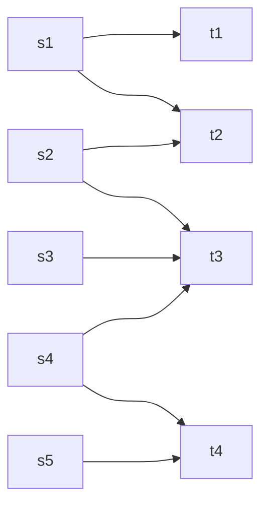

這樣的圖可以透過增加一個新的source $s$ 和一個新的sink $t$ 來解決，將所有的source都連接到$s$(管線容量為無限大)，所有的sink也都連接到$t$(管線容量為無限大)，這樣就可以將問題轉換成一個source和sink的問題。

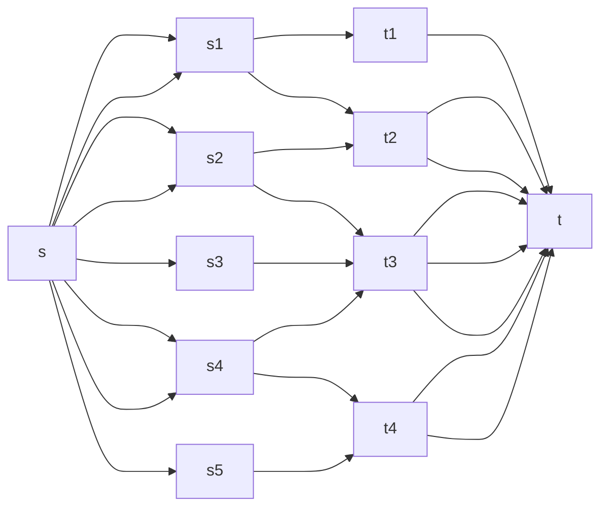

## 最大流的推廣&例題

先回顧一下我們有那些找到最大流的演算法

1. Ford–Fulkerson Algorithm，時間複雜度 $O(fE)$ ， $f$ 為最大流量  
2. Edmonds-Karp Algorithm，時間複雜度 $O(VE^2)$ (大致上不會用到)  
3. Capacity Scaling Algorithm，時間複雜度 $O(|E|^2(1+\log (c_{max}))$  

可能大部分人寫最大流問題會直接選Capacity Scaling Algorithm，因為時間複雜度最低，而且實作簡單，但這樣想就錯了，在蠻多應用中，邊的容量都是1，這時候使用Ford–Fulkerson Algorithm就可以更簡單解決問題，而且也不會爆複雜度(最大流量必定小於等於頂點數-1)。

### 最大流

因為前面都講過了，所以就來個例題吧~

[CSES Download Speed](https://cses.fi/problemset/task/1694)

> Consider a network consisting of n computers and m connections. Each connection specifies how fast a computer can send data to another computer.  
> Kotivalo wants to download some data from a server. What is the maximum speed he can do this, using the connections in the network?  

解法：因為每條容量最大會到 $10^9$ ，所以就用Capacity Scaling Algorithm



```cpp
#include <bits/stdc++.h>
using namespace std;
/* TYPES  */
#define int long long
#define pii pair<int, int>
#define F first
#define S second
#define vc vector
#define vi vector<int>
#define vii vector<pii>
#define mii map<int, int>
#define si set<int>
/* UTILS */
#define rep(i, a, b) for (int i = a; i <= b; ++i)
#define rev(i, a, b) for (int i = a; i >= b; --i)
#define tomax(a, b) (a) = max((a), (b))
#define tomin(a, b) (a) = min((a), (b))
#define all(a) a.begin(), a.end()
#define rall(a) (a).rbegin(), (a).rend()
#define pob pop_back
#define pb push_back
#define eb emplace_back
#define ins insert
#define err(a) cerr << #a << ": " << a << "\n"
#define sp << " " <<
#define ios ios_base::sync_with_stdio(0), cin.tie(0), cout.tie(0)

int n, m;
int adj[502][502];
bool vis[502];

bool dfs(int rt, vector<int> &path, int threshold) {
    if (vis[rt]) return false;
    vis[rt] = 1;
    if (rt == n) {
        path.push_back(rt);
        return true;
    }
    rep(i, 1, n) {
        if (adj[rt][i] < threshold) continue;
        if (dfs(i, path, threshold)) {
            path.push_back(rt);
            return true;
        }
    }
    return false;
}

signed main() {
    ios;
    cin >> n >> m;
    int threshold = 0;
    rep(i, 1, m) {
        int a, b, c;
        cin >> a >> b >> c;
        adj[a][b] += c;
        tomax(threshold, c);
    }
    int ans = 0;
    while (threshold > 0) {
        vector<int> path;
        memset(vis, 0, sizeof(vis));
        if (dfs(1, path, threshold)) {
            reverse(path.begin(), path.end());
            int k = path.size();
            int flow = 1e9;
            rep (i, 0, k-2) tomin(flow, adj[path[i]][path[i + 1]]);
            ans += flow;
            rep (i, 0, k-2) {
                adj[path[i]][path[i + 1]] -= flow;
                adj[path[i + 1]][path[i]] += flow;
            }
        } else threshold >>= 1;
    }
    cout << ans << "\n";
    return 0;
}
```



### 最小割

> 最小割(Min-Cut)：一個 $s-t\ cut$ ，使得 $c(S,T)=\sum_{u\in S, v\in T}c(u,v)$ 為最小值

我先定義 $f(S,T)=\sum_{u\in S, v\in T}f(u,v)$ ，因為任何一個割的流量都來自 $s$ ，因此我們可以很輕易的推得：  
$$\forall \ s-t\ cut, f(S,T) = |f|$$  
( $|f|$ 為 $s$ 流入的總流量)  
因為每個 $cut$ 流量都一樣，所以說我們可以把最小割問題想做是不斷把入口的流量增大，直到有`第一個` $cut$ ，使得 $f(S,T)=c(S,T)$ ，那麼就找到最小割了，要怎麼知道這個是最大流呢？也很簡單，因為對於個 $cut$ 上的每一條邊，都有 $f(u,v)=c(u,v)$ ，若是想再增加流量，每當流經這個 $cut$ 時，流量都會被`阻塞`，無法使得總流量變得更大。  
而至於應該怎麼找到一個合法的最小割，還有最小割上的邊，可以看看下面的例題。

#### 最小割の例題

[CSES Police Chase](https://cses.fi/problemset/task/1695)

> Kaaleppi has just robbed a bank and is now heading to the harbor. However, the police wants to stop him by closing some streets of the city.  
> What is the minimum number of streets that should be closed so that there is no route between the bank and the harbor?

解法：這題可以把所有路徑的容量都設成1，然後用Ford–Fulkerson Algorithm找到最小割的容量了，接著利用最後一次找augmenting path拜訪過的點區分各點是屬於 $S$ 還是 $T$ 集合(因為最後一次找augmenting path是失敗的，整張圖已經有最大流，並且存在一個最小割上的容量=流量，所以說最小割的剩餘流量為0，因此從起始點 $s$ 流經過那一個最小割時，所有的路線都會被`阻塞`，這時就能利用當前是否被拜訪，判斷點是在哪個集合中)，而`跨越` $s$ 和 $t$ 的邊，就會是最小割的其中一員。



```cpp CSES Police Chase
#include <bits/stdc++.h>
using namespace std;
/* TYPES  */
#define int long long
#define pii pair<int, int>
#define F first
#define S second
#define vc vector
#define vi vector<int>
#define vii vector<pii>
#define mii map<int, int>
#define si set<int>
/* UTILS */
#define rep(i, a, b) for (int i = a; i <= b; ++i)
#define rev(i, a, b) for (int i = a; i >= b; --i)
#define tomax(a, b) (a) = max((a), (b))
#define tomin(a, b) (a) = min((a), (b))
#define all(a) a.begin(), a.end()
#define rall(a) (a).rbegin(), (a).rend()
#define pob pop_back
#define pb push_back
#define eb emplace_back
#define ins insert
#define err(a) cerr << #a << ": " << a << "\n"
#define sp << " " <<
#define ios ios_base::sync_with_stdio(0), cin.tie(0), cout.tie(0)

int n, m, ans;
int g[502][502];
bool vis[502];

bool dfs(int rt){
    if(vis[rt]) return 0;
    if(rt == n) return 1;
    vis[rt] = 1;
    rep(i, 1, n){
        if(g[rt][i] && dfs(i)){
            g[rt][i]--, g[i][rt]++;
            return 1;
        }
    }
    return 0;
}

signed main() {
    ios;
    cin >> n >> m;
    rep(i, 1, m){
        int a, b;
        cin >> a >> b;
        g[a][b] = g[b][a] = 1;
    }
    while(dfs(1)) memset(vis, 0, sizeof(vis)), ans++;
    cout << ans << '\n';
    rep(i, 1, n){
        rep(j, 1, n){
            if((vis[i] ^ vis[j]) && !g[i][j] && g[j][i]) cout << i sp j << '\n';
        }
    }
    return 0;
}
```



### 最多不重複路徑

若是將每條路徑流量都設為1，那麼就代表這條被走過之後就不能再走了，因此最終能有多少條路徑能從起點到終點，就會是最多不重複路徑的數量，也就會是最大流量。

那應該怎麼找到路徑的順序呢？可以想想看找完最大流後的Residual Graph，因為演算法會幫我們把走錯的路導正，除起點與終點外，每個節點都必定只有進入和出去各1的流量，所以只要從起點開始，不斷找Residual Capacity為0的邊，然後再從這條邊的終點找下一條Residual Capacity為0的邊，直到找到終點為止。

#### 最多不重複路徑の例題

[CSES Distinct Routes](https://cses.fi/problemset/task/1711)

> A game consists of n rooms and m teleporters. At the beginning of each day, you start in room 1 and you have to reach room n.
> You can use each teleporter at most once during the game. How many days can you play if you choose your routes optimally?

解法：這題一樣把所有路徑的容量都設成1，然後用Ford–Fulkerson Algorithm找到最大流，然後就用前述方法即可找到各個實際路徑是怎麼走的了。



```c++ CSES Distinct Routes
#include <bits/stdc++.h>
using namespace std;
/* TYPES  */
#define int long long
#define pii pair<int, int>
#define F first
#define S second
#define vc vector
#define vi vector<int>
#define vii vector<pii>
#define mii map<int, int>
#define si set<int>
/* UTILS */
#define rep(i, a, b) for (int i = a; i <= b; ++i)
#define rev(i, a, b) for (int i = a; i >= b; --i)
#define tomax(a, b) (a) = max((a), (b))
#define tomin(a, b) (a) = min((a), (b))
#define all(a) a.begin(), a.end()
#define rall(a) (a).rbegin(), (a).rend()
#define pob pop_back
#define pb push_back
#define eb emplace_back
#define ins insert
#define err(a) cerr << #a << ": " << a << "\n"
#define sp << " " <<
#define ios ios_base::sync_with_stdio(0), cin.tie(0), cout.tie(0)

int n, m, ans = 0;
int g[502][502];
bool vis[502];
vi go[502];

bool dfs(int rt){
    if(vis[rt]) return 0;
    if(rt == n) return 1;
    vis[rt] = 1;
    rep(i, 1, n){
        if(g[rt][i] && dfs(i)) {
            g[rt][i]--, g[i][rt]++;
            return 1;
        }
    }
    return 0;
}

signed main() {
    ios;
    cin >> n >> m;
    rep(i, 1, m){
        int a, b;
        cin >> a >> b;
        g[a][b]++;
        go[a].eb(b);
    }
    while(dfs(1)) memset(vis, 0, sizeof(vis)), ans++;
    cout << ans << '\n';
    while(ans--){
        vi path(1,1);
        int s = 1;
        while(s!=n){
            for(int i : go[s])
                if(!g[s][i] && g[i][s]){
                    g[i][s]=0;
                    s=i;
                    path.eb(i);
                    break;
                }
        }
        cout << path.size() << '\n';
        for(int i : path) cout << i << ' ';
        cout << '\n';
    }
    return 0;
}
```



### 二分圖最大匹配

這個的做法是先兩個集合的點，各別連接一個source和sink(見[如果有好幾個source或sink怎麼辦？](/algo_Max-Flow_and_Min-Cut/#如果有好幾個source或sink怎麼辦？))，我們可以將圖分為四個區塊，如下圖：

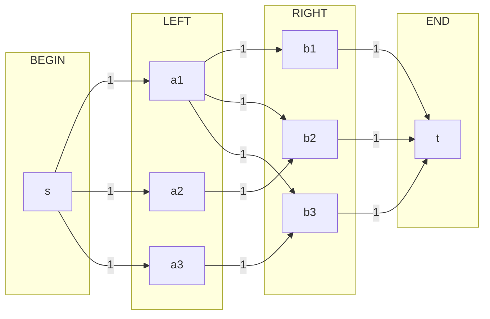

我們可以認定一條 $s$ 流到 $t$ 的路徑就代表一個配對，並且因為LEFT的每個點流入量都是1，RIGHT的每個點流出量是1，所以所有點配對時最多只能使用一次，因此最終能有多少條路徑能從起點到終點，就會是最大匹配的數量，也就會是最大流量，而找路徑的方法就如同[最多不重複路徑](/algo_Max-Flow_and_Min-Cut/#最多不重複路徑)一樣。

#### 二分圖最大匹配の例題

[CSES School Dance](https://cses.fi/problemset/task/1696)

> There are n boys and m girls in a school. Next week a school dance will be organized. A dance pair consists of a boy and a girl, and there are k potential pairs.  
> Your task is to find out the maximum number of dance pairs and show how this number can be achieved.

解法：還是一樣把所有路徑的容量都設成1，然後用Ford–Fulkerson Algorithm找到最大流，然後就用前面講的方法轉換成匹配結果。



```c++ CSES School Dance
#include <bits/stdc++.h>
using namespace std;
/* TYPES  */
#define int long long
#define pii pair<int, int>
#define F first
#define S second
#define vc vector
#define vi vector<int>
#define vii vector<pii>
#define mii map<int, int>
#define si set<int>
/* UTILS */
#define rep(i, a, b) for (int i = a; i <= b; ++i)
#define rev(i, a, b) for (int i = a; i >= b; --i)
#define tomax(a, b) (a) = max((a), (b))
#define tomin(a, b) (a) = min((a), (b))
#define all(a) a.begin(), a.end()
#define rall(a) (a).rbegin(), (a).rend()
#define pob pop_back
#define pb push_back
#define eb emplace_back
#define ins insert
#define err(a) cerr << #a << ": " << a << "\n"
#define sp << " " <<
#define ios ios_base::sync_with_stdio(0), cin.tie(0), cout.tie(0)

int n, m, k, ans;
int g[1003][1003];
bool vis[1003];
vi go[1003];

bool dfs(int rt){
    if(vis[rt]) return 0;
    if(rt == 1001) return 1;
    vis[rt] = 1;
    rep(i, 1, 1001){
        if(g[rt][i] && dfs(i)){
            g[rt][i]--, g[i][rt]++;
            return 1;
        }
    }
    return 0;
}

signed main() {
    ios;
    cin >> n >> m >> k;
    rep(i, 1, k){
        int a, b;
        cin >> a >> b;
        g[0][a] = g[a][b+500] = g[b+500][1001] = 1;
        go[0].eb(a), go[a].eb(b+500), go[b+500].eb(1001);
    }
    while(dfs(0)) memset(vis, 0, sizeof(vis)), ans++;
    cout << ans << '\n';
    while(ans--){
        int a, b, s = 0;
        while(s != 1001){
            a=b, b=s;
            for(int i : go[s]) 
                if(!g[s][i] && g[i][s]){
                    g[s][i]=1;
                    s=i;
                    break;
                }
        }
        cout << a sp b-500 << '\n';
    }
    return 0;
}
```



<!-- ### 二分圖最小頂點覆蓋 (Kőnig's theorem)

#### 二分圖最小頂點覆蓋の例題



```c++

```

 -->

<!-- ### Path covers -->

## 延伸閱讀（參考資料）

1. [Competitive Programmer’s Handbook, Chapter 20, Flows and cuts](https://cses.fi/book/book.pdf#Flows%20and%20cuts)
2. [Ford–Fulkerson Algorithm](https://en.wikipedia.org/wiki/Ford%E2%80%93Fulkerson_algorithm)
3. [演算法第26章 Maximum Flow](https://youtu.be/rSYW9pKGEAU)
4. [OI Wiki - 最大流](https://oi-wiki.org/graph/flow/max-flow/)
