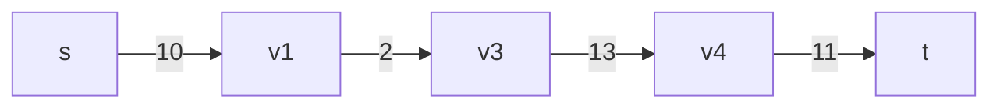
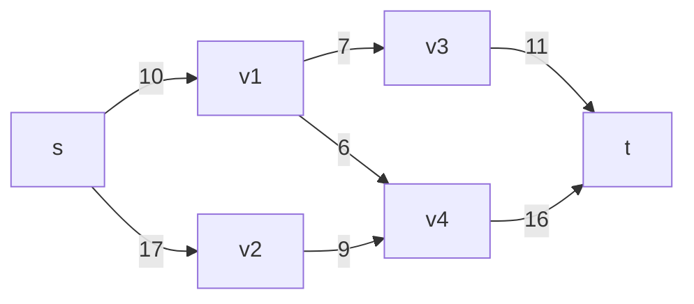
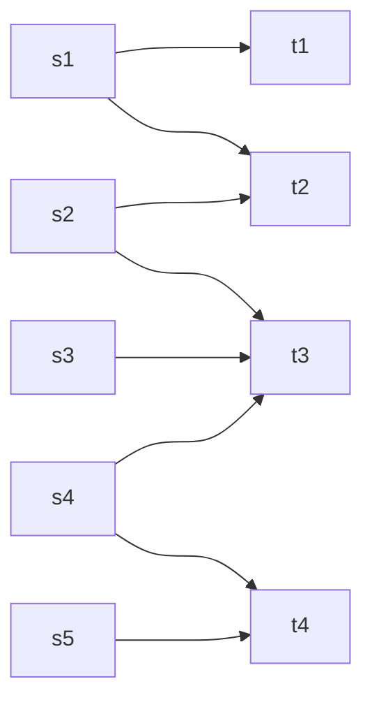
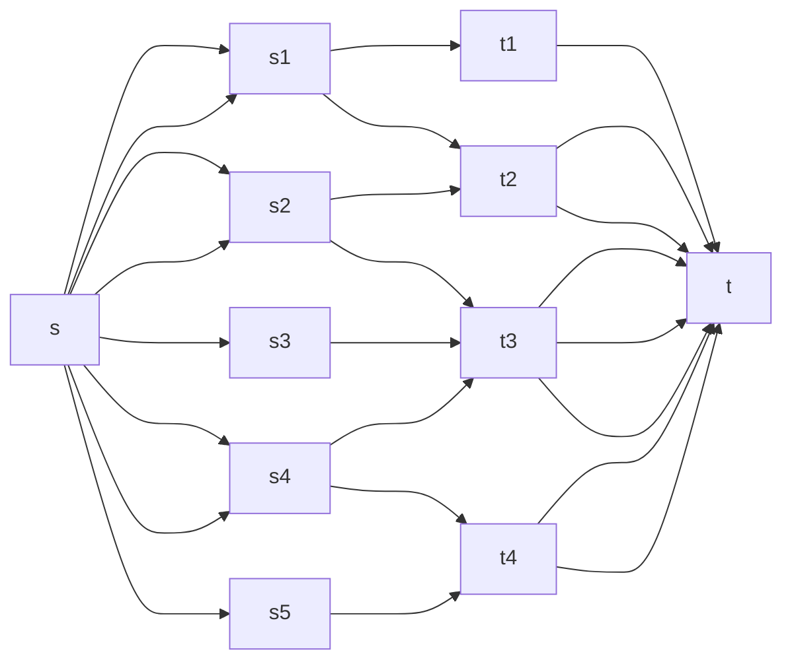

## 前言

一個由多個站點連接而成的網絡裡，每對站點之間都有一定的數據傳輸限制(單向)。現在你需要計算從網絡的入口（$s$）到出口（$t$）之間，數據可以同時傳輸的最大速度是多少。  
如下圖，從 $s$ 到 $t$ 的最大傳輸速度為2，最大速度會被路徑上最大傳輸流量所限制，因爲從 $s$ 到 $t$ 勢必通過路線 $v1\rightarrow v2$ ，故這張圖的最大流量為2。



而下面這個圖的最大流量為19，下文提供一種可能的傳輸方式：



- 傳輸7： $s\rightarrow v1\rightarrow v3\rightarrow t$
- 傳輸3： $s\rightarrow v1 \rightarrow v4 \rightarrow t$ (因為 $s\rightarrow v1$ 最多只能傳輸10因此在前一次傳輸7之後，接下來就只能傳輸3了)
- 傳輸9： $s \rightarrow v2 \rightarrow v4 \rightarrow t$
- 7+3+9=19

上述這樣的圖叫做Network Flow(網路流)，在這樣的圖上尋找這種`最大流`的想法還可以運用在`最小割`(後文會再解釋)、`最多不重複路徑`、`二分圖最大匹配`、`二分圖最小頂點覆蓋`等圖論問題。

<!--more-->

## `Network Flow(網路流)` 的基本定義

這邊可以先看個印象，之後如果有旺的再回來看

- A directed graph $G = (V,E)$
- $\exists$ one source point(入口，記作$s$) and one sink point(出口，記作$t$)
- $c(u,v)$ 表示從 $u$ 到 $v$ 的容量(Capacity)
- $f(u,v)$ 表示從 $u$ 到 $v$ 的流量(Flow)
- $\forall \ edge(u,v) \notin E \Rightarrow c(u,v) = 0 \Rightarrow f(u,v) = 0$
- $|f|=\sum_{u\in V}f(s,v)$ (也就是從起點流出的總量)
- $\forall \ u \in V - \{s, t\} , \ \exists \ path: \ s \rightarrow u \rightarrow t$
- 容量限制：恆有 $0 \leq f(u,v) \leq c(u,v)$
- 流量守恆： $\forall \ u \in V - \{s,t\}, \ \sum_{v\in V}f(u,v) = \sum_{v\in V}f(v,u)$
- 一個 $s-t\ cut$ 表示能將圖切成兩個集合 $S,T$ ，滿足：
  - $S\cap T = \emptyset , \ S\cup T = V$
  - $s\in S, \ t\in T$
- augmenting path：一條起點為$s$，終點為$t$的簡單路徑（沒有環）
- $r(u,v)$ (Residual Capacity)：$edge(u,v)$上扣除已有流量還可以傳輸多少流量才會飽和，意即 $r(u,v)=c(u,v)-f(u,v)$ (Residual Capacity = Capacity - Flow)
- Residual graph：圖邊上數字為剩餘容量
- backward edge：反向邊（之後會提到）

<!-- ## 性質

- $|f|=\sum_{u\in V}f(s,v)=\sum_{u\in V}f(v,t)$，可以很直觀想作輸入流量等於輸出流量，或是利用流量守恆來證明：  
  $\sum_{u \in V- \{s,t\}}(\sum_{v\in V}f(u,v)-\sum_{v\in V}f(v,u))$ $=\sum_{u\in V}f(s,v)-\sum_{u\in V}f(v,t)=0$ -->

## 何謂最大流(Max-Flow)與最小割(Min-Cut)

- 最大流(Max-Flow)：從 $s$ 到 $t$ 的最大流量，寫的嚴謹一點就是：$|f|=\sum_{u\in V}f(s,v)$ 的最大值
- 最小割(Min-Cut)：一個 $s-t\ cut$ ，使得 $c(S,T)=\sum_{u\in S, v\in T}c(u,v)$ 為最小值

而特別的是一張圖的最大流量等於最小割的容量，這個性質會在後續講述[最小割](/algo_Max-Flow_and_Min-Cut/#最小割)時證明

## 怎麼找到最大流？

我們或許可以從$s$開始，每次找到一條augmenting path，然後將這條路徑上每個邊的流量增加路徑上所有邊中最小的Residual Capacity，不斷增加流量直到沒辦法增加為止，最後一路上所增加的Residual Capacity或許就是最大流...嗎?  

<!-- TODO 舉例 -->

我們試著用這個方法來找找看。

### Naïve Algorithm

因為需要找到一路上最小的Residual Capacity，所以我們將圖上的邊設為Residual Capacity會相較同時紀錄Flow和Capacity來得方便，並且認定當某條邊的Residual Capacity為0時，那該條路徑已經不能夠走了，因此就能將終止條件`不斷增加流量直到沒辦法增加為止`改為`找不到一條augmenting path`(若是沒辦法繼續增加流量，就代表無法找到一條augmenting path上所有的Residual Capacity皆不為0)，我們可以根據以上邏輯寫出虛擬碼：


Initialize $r(u, v)=c(u, v) \ \forall \ edge(u,v) \in E$  
let $answer$ be $0$  
while exist an augmenting path $p$  
　　let $min_r$ be $min\{r(u, v)\ \forall \ edge(u, v) \in p\}$  
　　　　for each $edge(u, v)$ in $p$  
　　　　　　$r(u, v)$ -= $min_r$  
　　　　　　$answer$ += $min_r$


不過呢，其實這個做法是不對的，來看個反例

<!-- TODO 舉例 -->

但難道努力這麼久想到的方法就這樣付之一炬了嗎?我們有沒有可能想個辦法讓把原先走錯的路線`復原`，讓路給其他的流量走呢?這就是`Ford–Fulkerson Algorithm`的精神。

### Ford–Fulkerson Algorithm

這就輪到的先前提到的`backward edge(反向邊)`出場了，我們在每次找到一條augmenting path時，將這條路徑上所有的邊的Residual Capacity減少，同時增加一條反向邊，將減少的Residual Capacity加到反向邊上，到時候其他路徑被該條路阻塞時，這條反向邊就像是能提供原先走錯路線`復原`的功能，`讓路`給其他的流量走，或許這樣講不夠清楚，我們直接將這個方法套用到先前失敗的例子上

<!-- TODO 舉例 -->

這個實現的的方法非常簡單，只要將原先的虛擬碼再多一個建立反向邊的程式就完成了

  
Initialize $r(u, v)=c(u, v) \ \forall \ edge(u,v) \in E$  
let $answer$ be $0$  
while exist an augmenting path $p$  
　　let $min_r$ be $min\{r(u, v)\ \forall \ edge(u, v) \in p\}$  
　　　　for each $edge(u, v)$ in $p$  
　　　　　　$r(u, v)$ -= $min_r$  
　　　　　　$r(v, u)$ += $min_r$  
　　　　　　$answer$ += $min_r$


#### 複雜度

考慮到最糟糕的情況，每次都只增加1的流量，那麼最多就會需要增加最大流量次，這裡舉一個例子：

<!-- TODO 舉例 -->

所以時間複雜度為$O(fE)$，$f$為最大流量，$E$為邊數。很顯然的在流量很大很大可能$10^9$的情況下，這種方法是不好的，那有沒有什麼樣遍歷的方法可以讓每次增加的流量盡可能的高減少遍歷次數呢?這就是`Edmonds-Karp Algorithm`和`Capacity Scaling Algorithm`在做的事。

### Edmonds-Karp Algorithm


### Capacity Scaling Algorithm

## 如果有好幾個source或sink怎麼辦？



這樣的圖可以透過增加一個新的source $s$ 和一個新的sink $t$ 來解決，將所有的source都連接到$s$(管線容量為無限大)，所有的sink也都連接到$t$(管線容量為無限大)，這樣就可以將問題轉換成一個source和sink的問題。



## 最大流的推廣&例題

先回顧一下我們有那些找到最大流的演算法

1. Ford–Fulkerson Algorithm，時間複雜度$O(fE)$，$f$為最大流量
2. Edmonds-Karp Algorithm，時間複雜度$O(VE^2)$ (這個好像是都不會用到)
3. Capacity Scaling Algorithm，時間複雜度$O(VE\log C)$，$C$為最大容量

可能大部分人寫最大流問題會直接選Capacity Scaling Algorithm，因為時間複雜度最低，而且實作簡單，但這樣想就錯了，在蠻多應用中，邊的容量都是1，這時候使用Ford–Fulkerson Algorithm可以更簡單解決問題，而且也不會爆複雜度(最大流量必定小於等於頂點數-1)。

### 最大流

因為前面都講過了，所以就來個例題吧~

[CSES Download Speed](https://cses.fi/problemset/task/1694)

> Consider a network consisting of n computers and m connections. Each connection specifies how fast a computer can send data to another computer.  
> Kotivalo wants to download some data from a server. What is the maximum speed he can do this, using the connections in the network?  

解法：因為每條容量最大會到$10^9$，所以就用Capacity Scaling Algorithm



```cpp
#include <bits/stdc++.h>
using namespace std;
/* TYPES  */
#define int long long
#define pii pair<int, int>
#define F first
#define S second
#define vc vector
#define vi vector<int>
#define vii vector<pii>
#define mii map<int, int>
#define si set<int>
/* UTILS */
#define rep(i, a, b) for (int i = a; i <= b; ++i)
#define rev(i, a, b) for (int i = a; i >= b; --i)
#define tomax(a, b) (a) = max((a), (b))
#define tomin(a, b) (a) = min((a), (b))
#define all(a) a.begin(), a.end()
#define rall(a) (a).rbegin(), (a).rend()
#define pob pop_back
#define pb push_back
#define eb emplace_back
#define ins insert
#define err(a) cerr << #a << ": " << a << "\n"
#define sp << " " <<
#define ios ios_base::sync_with_stdio(0), cin.tie(0), cout.tie(0)

int n, m;
int adj[502][502];
bool vis[502];

bool dfs(int rt, vector<int> &path, int threshold) {
    if (vis[rt]) return false;
    vis[rt] = 1;
    if (rt == n) {
        path.push_back(rt);
        return true;
    }
    rep(i, 1, n) {
        if (adj[rt][i] < threshold) continue;
        if (dfs(i, path, threshold)) {
            path.push_back(rt);
            return true;
        }
    }
    return false;
}

signed main() {
    ios;
    cin >> n >> m;
    int sum = 0;
    rep(i, 1, m) {
        int a, b, c;
        cin >> a >> b >> c;
        adj[a][b] += c;
        sum += c;
    }
    int ans = 0;
    while (sum > 0) {
        vector<int> path;
        memset(vis, 0, sizeof(vis));
        if (dfs(1, path, sum)) {
            reverse(path.begin(), path.end());
            int k = path.size();
            int flow = 1e9;
            rep (i, 0, k-2) tomin(flow, adj[path[i]][path[i + 1]]);
            ans += flow;
            rep (i, 0, k-2) {
                adj[path[i]][path[i + 1]] -= flow;
                adj[path[i + 1]][path[i]] += flow;
            }
        } else sum /= 2;
    }
    cout << ans << "\n";
    return 0;
}
```



### 最小割

#### 最小割の例題

[CSES Police Chase](https://cses.fi/problemset/task/1695)

> Kaaleppi has just robbed a bank and is now heading to the harbor. However, the police wants to stop him by closing some streets of the city.  
> What is the minimum number of streets that should be closed so that there is no route between the bank and the harbor?

解法：這題可以把所有路徑的容量都設成1，然後用Ford–Fulkerson Algorithm找到最小割的容量了，接著利用最後一次找augmenting path拜訪過的點區分各點是屬於$S$還是$T$集合(因為最後一次找augmenting path是失敗的，整張圖已經有最大流並存再一個最小割上的容量=流量，所以說該最小割的剩餘流量為0，因此從起始點$s$行經過那一個最小割時，所有的路線都會被`阻塞`，這時就能利用當前是否被拜訪，判斷點是在哪個集合中)，並可以藉由判斷各點之間正、反向剩餘流量的數值，推斷各個邊是否被最小割經過(若正向剩餘流量為0，反向剩餘流量不為0，就表示這條邊容量=流量，另外因為這題的路徑容量是1所以懶惰一點的話可以指判斷反向剩餘流量是否不為0即可)。



```cpp CSES Police Chase
#include <bits/stdc++.h>
using namespace std;
/* TYPES  */
#define int long long
#define pii pair<int, int>
#define F first
#define S second
#define vc vector
#define vi vector<int>
#define vii vector<pii>
#define mii map<int, int>
#define si set<int>
/* UTILS */
#define rep(i, a, b) for (int i = a; i <= b; ++i)
#define rev(i, a, b) for (int i = a; i >= b; --i)
#define tomax(a, b) (a) = max((a), (b))
#define tomin(a, b) (a) = min((a), (b))
#define all(a) a.begin(), a.end()
#define rall(a) (a).rbegin(), (a).rend()
#define pob pop_back
#define pb push_back
#define eb emplace_back
#define ins insert
#define err(a) cerr << #a << ": " << a << "\n"
#define sp << " " <<
#define ios ios_base::sync_with_stdio(0), cin.tie(0), cout.tie(0)

int n, m, ans;
int g[502][502];
bool vis[502];

bool dfs(int rt){
    if(vis[rt]) return 0;
    if(rt == n) return 1;
    vis[rt] = 1;
    rep(i, 1, n){
        if(g[rt][i] && dfs(i)){
            g[rt][i]--, g[i][rt]++;
            return 1;
        }
    }
    return 0;
}

signed main() {
    ios;
    cin >> n >> m;
    rep(i, 1, m){
        int a, b;
        cin >> a >> b;
        g[a][b] = g[b][a] = 1;
    }
    while(dfs(1)) memset(vis, 0, sizeof(vis)), ans++;
    cout << ans << '\n';
    rep(i, 1, n){
        rep(j, 1, n){
            if((vis[i] ^ vis[j]) && !g[i][j] && g[j][i]) cout << i sp j << '\n';
        }
    }
    return 0;
}
```



### 最多不重複路徑

#### 最多不重複路徑の例題

[CSES Distinct Routes](https://cses.fi/problemset/task/1711)

> A game consists of n rooms and m teleporters. At the beginning of each day, you start in room 1 and you have to reach room n.
> You can use each teleporter at most once during the game. How many days can you play if you choose your routes optimally?

解法：這題一樣把所有路徑的容量都設成1，然後用Ford–Fulkerson Algorithm找到最大流，然後就用前述方法即可找到各個實際路徑是怎麼走的了。



```c++ CSES Distinct Routes
#include <bits/stdc++.h>
using namespace std;
/* TYPES  */
#define int long long
#define pii pair<int, int>
#define F first
#define S second
#define vc vector
#define vi vector<int>
#define vii vector<pii>
#define mii map<int, int>
#define si set<int>
/* UTILS */
#define rep(i, a, b) for (int i = a; i <= b; ++i)
#define rev(i, a, b) for (int i = a; i >= b; --i)
#define tomax(a, b) (a) = max((a), (b))
#define tomin(a, b) (a) = min((a), (b))
#define all(a) a.begin(), a.end()
#define rall(a) (a).rbegin(), (a).rend()
#define pob pop_back
#define pb push_back
#define eb emplace_back
#define ins insert
#define err(a) cerr << #a << ": " << a << "\n"
#define sp << " " <<
#define ios ios_base::sync_with_stdio(0), cin.tie(0), cout.tie(0)

int n, m, ans = 0;
int g[502][502];
bool vis[502];
vi go[502];

bool dfs(int rt){
    if(vis[rt]) return 0;
    if(rt == n) return 1;
    vis[rt] = 1;
    rep(i, 1, n){
        if(g[rt][i] && dfs(i)) {
            g[rt][i]--, g[i][rt]++;
            return 1;
        }
    }
    return 0;
}

signed main() {
    ios;
    cin >> n >> m;
    rep(i, 1, m){
        int a, b;
        cin >> a >> b;
        g[a][b]++;
        go[a].eb(b);
    }
    while(dfs(1)) memset(vis, 0, sizeof(vis)), ans++;
    cout << ans << '\n';
    while(ans--){
        vi path(1,1);
        int s = 1;
        while(s!=n){
            for(int i : go[s])
                if(!g[s][i] && g[i][s]){
                    g[i][s]=0;
                    s=i;
                    path.eb(i);
                    break;
                }
        }
        cout << path.size() << '\n';
        for(int i : path) cout << i << ' ';
        cout << '\n';
    }
    return 0;
}
```



### 二分圖最大匹配

#### 二分圖最大匹配の例題

[CSES School Dance](https://cses.fi/problemset/task/1696)

> There are n boys and m girls in a school. Next week a school dance will be organized. A dance pair consists of a boy and a girl, and there are k potential pairs.  
> Your task is to find out the maximum number of dance pairs and show how this number can be achieved.

解法：還是一樣把所有路徑的容量都設成1，然後用Ford–Fulkerson Algorithm找到最大流，然後就用前面講的方法轉換成匹配結果。



```c++ CSES School Dance
#include <bits/stdc++.h>
using namespace std;
/* TYPES  */
#define int long long
#define pii pair<int, int>
#define F first
#define S second
#define vc vector
#define vi vector<int>
#define vii vector<pii>
#define mii map<int, int>
#define si set<int>
/* UTILS */
#define rep(i, a, b) for (int i = a; i <= b; ++i)
#define rev(i, a, b) for (int i = a; i >= b; --i)
#define tomax(a, b) (a) = max((a), (b))
#define tomin(a, b) (a) = min((a), (b))
#define all(a) a.begin(), a.end()
#define rall(a) (a).rbegin(), (a).rend()
#define pob pop_back
#define pb push_back
#define eb emplace_back
#define ins insert
#define err(a) cerr << #a << ": " << a << "\n"
#define sp << " " <<
#define ios ios_base::sync_with_stdio(0), cin.tie(0), cout.tie(0)

int n, m, k, ans;
int g[1003][1003];
bool vis[1003];
vi go[1003];

bool dfs(int rt){
    if(vis[rt]) return 0;
    if(rt == 1001) return 1;
    vis[rt] = 1;
    rep(i, 1, 1001){
        if(g[rt][i] && dfs(i)){
            g[rt][i]--, g[i][rt]++;
            return 1;
        }
    }
    return 0;
}

signed main() {
    ios;
    cin >> n >> m >> k;
    rep(i, 1, k){
        int a, b;
        cin >> a >> b;
        g[0][a] = g[a][b+500] = g[b+500][1001] = 1;
        go[0].eb(a), go[a].eb(b+500), go[b+500].eb(1001);
    }
    while(dfs(0)) memset(vis, 0, sizeof(vis)), ans++;
    cout << ans << '\n';
    while(ans--){
        int a, b, s = 0;
        while(s != 1001){
            a=b, b=s;
            for(int i : go[s]) 
                if(!g[s][i] && g[i][s]){
                    g[s][i]=1;
                    s=i;
                    break;
                }
        }
        cout << a sp b-500 << '\n';
    }
    return 0;
}
```



### 二分圖最小頂點覆蓋

#### 二分圖最小頂點覆蓋の例題



```c++

```



## 延伸閱讀（參考資料）

1. [Competitive Programmer’s Handbook, Chapter 20, Flows and cuts](https://cses.fi/book/book.pdf#Flows%20and%20cuts)
2. [Ford–Fulkerson Algorithm](https://en.wikipedia.org/wiki/Ford%E2%80%93Fulkerson_algorithm)
3. [演算法第26章 Maximum Flow](https://youtu.be/rSYW9pKGEAU)
4. [OI Wiki - 最大流](https://oi-wiki.org/graph/flow/max-flow/)
