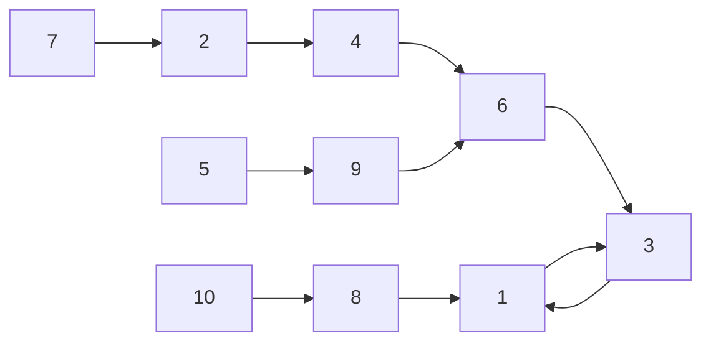

## 前言

為什麼叫做 `Functional`，顧名思義，他是一個多對一的圖（各個點出度皆為1），如下表所示：

| From | 1 | 2 | 3 | 4 | 5 | 6 | 7 | 8 | 9 | 10 |
|---|---|---|---|---|---|---|---|---|---|---|
| go | 3 | 4 | 1 | 6 | 9 | 3 | 2 | 1 | 6 | 8 |



這邊就整理了一些常見的題型，以及解題的方法。

<!--more-->

## 特性

各個聯通塊中必定`恰有`一個環(鴿籠原理)，且從該張圖的任意一點都必定能夠拜訪到該環

## 常見問題

### 找從當前點往後k點是什麼

<span id="inline-blue">倍增法</span>  
以 $ch_{ij}$ 表示 $i$ 往後 $2^j$ 是什麼， $ch_{i0}$ 就代表 $i$ 點的下一個點，詢問時使用類似位元枚舉的方式檢查

```c++
int ch[200005][31]; //[i][j] -> 2^j th child of i

void build(){
    rep(i, 1, 30)
        rep(j, 1, n)
            ch[j][i] = ch[ch[j][i-1]][i-1];
}

int query(int x, int k){
    for(int i = 0;k!=0; k>>=1, i++)
        if(k & 1)
            x = ch[x][i];
    return x;
}
```

### 是否聯通

<span id="inline-blue">DSU</span>  
就很基礎的操作，如果兩點相鄰就合併，然後最後檢查老大是不是一樣的

### 是否在環內、環內第幾個、環有多大

<span id="inline-blue">對所有點dfs</span>  
當該圖還從未被遍歷過時，第一次遇到以拜訪過的點，就是遇到環了（若從未拜訪過，第一次拜訪該聯通塊必定會遇到環，否則必定不會遇到環），然後開始往前回溯直到再次遇到該點就停止，這一路上的各個皆為環中的一員，並在回溯的過程中，從該節點的前一點編號加一，得到該點在環中排地幾，最後回溯終點的排名即為環的大小（可以用該點的老大作為該環的索引會比較方便）

```c++
int dfs(int rt) {
    if (vis[rt]) return rt;
    vis[rt] = 1;
    int flag = dfs(go[rt]);
    if (!sizeC[find_boss(rt)]) {
        inC[rt] = 1;
        idxC[rt] = idxC[go[rt]] + 1;
        if (flag == rt) sizeC[find_boss(rt)] = idxC[rt];
    }
    return flag;
}
```

### 距離環有多遠

從`在環上的各點`反向dfs`不在環上的邊`

```c++
void dfs2(int rt, int id) {
    idxA[rt] = id;
    for (int i : rgo[rt])
        if (!inC[i]) dfs2(i, id + 1);
}
```

## 例題

1. [Planets Queries I](https://cses.fi/problemset/task/1750)
2. [Planets Cycles](https://cses.fi/problemset/task/1751)
3. [Planets Queries II](https://cses.fi/problemset/task/1160)


註：如果要寫的話這個順序應該會比較合適，因為Planets Queries II應該要當作Planets Cycles的延伸才對(Planets Queries II比較難)，這樣才會有循序漸進的感覺

